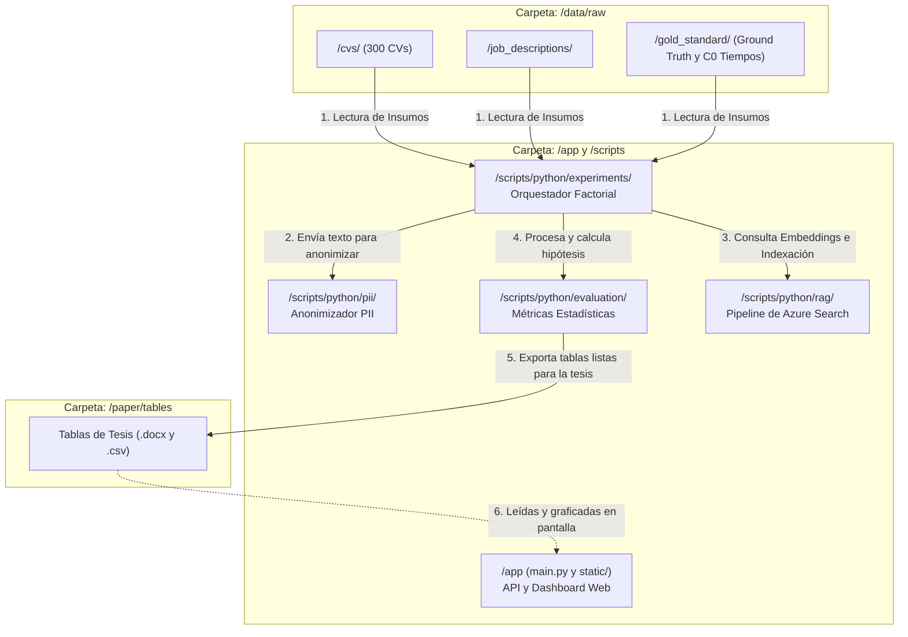

# Mapa del Repositorio y Estructura del Proyecto SISTAC

Este documento describe la estructura organizativa del repositorio del proyecto **SISTAC** para tu Trabajo de Fin de Estudios (TFE). Explica el propósito de cada carpeta y cómo interactúan el código, los datos y los reportes finales.

---

## 1. Árbol de Directorios del Proyecto

```text
clo-author/
│
├── app/                           # Aplicación FastAPI y Frontend Web
│   ├── main.py                    # Servidor API y endpoints (Cargos, Métricas, etc.)
│   └── static/                    # Interfaz de usuario (HTML, CSS, JS con Chart.js)
│       └── index.html             # Dashboard de administración y visualización
│
├── scripts/python/                # Código fuente lógico y experimental
│   ├── rag/                       # Vector store (Azure AI Search), pipeline e indexación
│   ├── llm/                       # Abstracción de APIs de Claude (Anthropic) y GPT (OpenAI)
│   ├── pii/                       # Módulo de anonimización para mitigación de sesgos (C3)
│   ├── scoring/                   # Criterios y prompt del calificador automático
│   ├── evaluation/                # Algoritmos estadísticos de métricas (H1, H2, H3)
│   └── experiments/               # Orquestador del experimento factorial (orquestador_c0_c3.py)
│
├── data/                          # Volumen de datos de entrada (Gold Standard)
│   └── raw/                       # Archivos de texto originales
│       ├── cvs/                   # 300 currículums sintéticos en formato .txt
│       ├── job_descriptions/      # 5 descripciones de puestos
│       └── gold_standard/         # Datos humanos (ground_truth.csv y c0_times.csv)
│
├── paper/                         # Memoria de la Tesis y Resultados Académicos
│   ├── SISTAC_TFE.docx            # Archivo de Word oficial de la tesis
│   ├── sections/                  # Capítulos y textos de ayuda en markdown (.md)
│   └── tables/                    # Tablas (.csv y .docx) auto-generadas para copiar y pegar
│
├── results/                       # Logs y resultados temporales de ejecuciones
│
├── guide/                         # Documentación técnica escrita en Quarto (.qmd)
│
├── tests/                         # Pruebas unitarias de calidad de software (pytest)
│
├── Dockerfile                     # Receta de empaquetado del contenedor FastAPI
├── docker-compose.yml             # Orquestador de servicios (sistac-app + mongodb)
└── .env                           # Credenciales de APIs y Azure (ignorado en git)
```

---

## 2. Diagrama de Interacción entre Carpetas

El siguiente diagrama de flujo ilustra cómo se mueven los datos y el control a través de las diferentes carpetas del proyecto cuando ejecutas la tesis o interactúas con el dashboard:



---

## 3. Propósito Detallado de las Secciones

### 1. `app/` (El Panel Web)
Es el frontend interactivo que permite visualizar el progreso del TFE. La API en `main.py` coordina las acciones del panel con MongoDB y el orquestador en segundo plano.

### 2. `scripts/python/` (La Lógica Científica)
Es el núcleo de la contribución técnica:
* `rag/`: Contiene el cargador robusto tolerante a fallos (`index_corpus.py`) y la lógica de recuperación de trozos de currículums.
* `pii/`: Contiene `anonymizer.py` que implementa técnicas de sustitución (anonimización) para asegurar que el LLM no reciba datos sensibles en C3.
* `evaluation/`: Contiene el cálculo de la prueba no paramétrica de Mann-Whitney U para H1, F1-macro para H2, yDIR/SPD para H3.

### 3. `data/` (El Dataset)
Contiene la información de partida del experimento. La subcarpeta `gold_standard/` sirve como la "verdad absoluta" que define si el sistema acierta (F1) y cuánto tiempo tarda de diferencia frente a la revisión manual de los 300 currículums.

### 4. `paper/` (La Tesis Escrita)
Contiene el documento oficial de Word del TFE y las tablas de Word generadas automáticamente. Para redactar la tesis, simplemente copias las tablas desde `/tables/` y las pegas en tu documento final.

### 5. `guide/` (La Documentación)
Compila la documentación en formato Quarto para presentar la arquitectura del proyecto, diagramas adicionales y guías de personalización a los directores del TFE.
