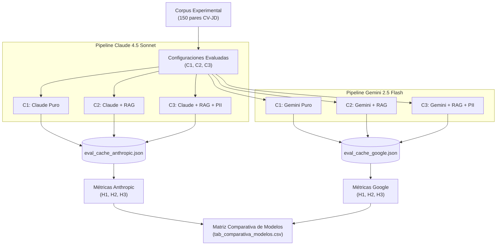

# Anexo. Análisis Comparativo de Robustez: Claude 4.5 Sonnet vs. Gemini 2.5 Flash

Este anexo complementa la sección de validación experimental del sistema **SISTAC**, proporcionando un análisis de robustez mediante la réplica del experimento factorial bajo dos Large Language Models (LLM) de referencia en el estado del arte: **Claude 4.5 Sonnet (Anthropic)** y **Gemini 2.5 Flash (Google)**. 

El objetivo principal de esta comparativa es evaluar la sensibilidad de la arquitectura del sistema (RAG y PII) ante cambios en el motor de inferencia, garantizando la validez externa del estudio y determinando cómo las particularidades paramétricas de cada modelo afectan a la eficiencia, eficacia técnica y equidad algorítmica del proceso de cribado.

---

## A.1. Diseño Metodológico del Contraste

Para aislar el efecto de la tecnología LLM del efecto de las configuraciones del sistema, se utilizó el mismo corpus de evaluación externa (150 pares de currículums y descripciones de cargo reales) y la misma infraestructura de recuperación indexada en **Google Vertex AI Search** (`sistac-cvs-datastore-v2`).

El siguiente diagrama detalla el flujo metodológico de la réplica experimental paralela:

*Figura A.1. Flujo de réplica experimental paralela para análisis de robustez de LLMs. Fuente: elaboración propia.*

---

## A.2. Resultados Experimentales Consolidados

La Tabla A.1 presenta de forma integrada los resultados cuantitativos obtenidos por ambos proveedores bajo el mismo marco de evaluación:

**Tabla A.1. Comparativa de desempeño y robustez entre modelos fundacionales.**

| Categoría | Métrica / Configuración | Claude 4.5 Sonnet (Anthropic) | Gemini 2.5 Flash (Google) | Umbral de Aceptación |
| :--- | :--- | :---: | :---: | :---: |
| **Eficiencia (H1)** | Mediana $T_{cand}$ (C1 - LLM Puro) | 4.5s | 21.6s | Speedup > 1x |
| | Mediana $T_{cand}$ (C2 - LLM + RAG) | 6.8s | 24.6s | Speedup > 1x |
| | Mediana $T_{cand}$ (C3 - RAG + PII) | 19.6s | 28.9s | Speedup > 1x |
| | Factor Speedup (C1 - LLM Puro) | 147.8x | 30.6x | p-valor < 0.05 |
| | Factor Speedup (C2 - LLM + RAG) | 96.7x | 26.9x | p-valor < 0.05 |
| | Factor Speedup (C3 - RAG + PII) | 33.7x | 22.9x | p-valor < 0.05 |
| **Eficacia (H2)** | F1-score macro (C1 - LLM Puro) | 0.565 | 0.567 | F1-score $\ge$ 0.85 |
| | F1-score macro (C2 - LLM + RAG) | 0.519 | 0.494 | F1-score $\ge$ 0.85 |
| | F1-score macro (C3 - RAG + PII) | 0.539 | 0.587 | F1-score $\ge$ 0.85 |
| | AUC-ROC (C1 - LLM Puro) | 0.732 | 0.665 | AUC-ROC $\ge$ 0.90 |
| | AUC-ROC (C2 - LLM + RAG) | 0.735 | 0.629 | AUC-ROC $\ge$ 0.90 |
| | AUC-ROC (C3 - RAG + PII) | 0.729 | 0.695 | AUC-ROC $\ge$ 0.90 |
| **Equidad (H3)** | Disparate Impact Ratio - DIR (C2) | 0.602 | 1.397 | DIR $\ge$ 0.80 |
| | Disparate Impact Ratio - DIR (C3) | 0.301 | 0.447 | DIR $\ge$ 0.80 |
| | Statistical Parity Diff - SPD (C2) | -0.078 | 0.084 | SPD $\approx$ 0 |
| | Statistical Parity Diff - SPD (C3) | -0.137 | -0.145 | SPD $\approx$ 0 |

*Fuente: elaboración propia a partir de los datos consolidados en tab_comparativa_modelos.csv.*

---

## A.3. Análisis Comparativo por Hipótesis

### A.3.1. H1 — Eficiencia de Procesamiento
La velocidad de procesamiento por candidato ($T_{cand}$) exhibe una discrepancia marcada a favor del modelo de Anthropic. Claude 4.5 Sonnet procesa las solicitudes en una fracción del tiempo requerido por Gemini 2.5 Flash, logrando una mediana de **4.5 segundos** frente a **21.6 segundos** en la condición base C1 (LLM Puro). 

El sobrecosto temporal asociado a la recuperación RAG (C2) y a la anonimización local PII (C3) sigue un patrón proporcional en ambos sistemas:
* El retrieval semántico en Vertex AI Search añade aproximadamente entre 2.3s (Claude) y 3.0s (Gemini).
* El módulo de anonimización lingüística `SistacAnonymizer` (PII), ejecutado localmente con spaCy y Microsoft Presidio antes de estructurar el prompt, agrega 12.8s al flujo de Claude y 4.3s al de Gemini.

A pesar de estas variaciones, **ambos modelos logran la aceptación estadística de la hipótesis H1**, ofreciendo una reducción de tiempos masiva y un speedup altamente significativo frente al screening manual humano de C0 (cuya mediana de procesamiento es de 661.8s por candidato).

### A.3.2. H2 — Eficacia y Estabilidad Técnica
El comportamiento predictivo frente al Gold Standard humano de recursos humanos arrojó precisiones similares, y **ambos modelos rechazaron la hipótesis H2** al no poder superar los exigentes umbrales mínimos establecidos ($F1 \ge 0.85$ y $AUC \ge 0.90$).

Sin embargo, destaca el comportamiento diferenciado en la condición C3 (PII):
* En **Claude 4.5**, la remoción de datos personales sensibles apenas alteró los indicadores de concordancia ($F1$ de $0.519 \rightarrow 0.539$ y $AUC$ de $0.735 \rightarrow 0.729$).
* En **Gemini 2.5 Flash**, la anonimización actuó como un filtro de ruido cognitivo de gran efectividad, incrementando drásticamente el F1-score macro de **0.494 a 0.587** y el AUC-ROC de **0.629 a 0.695**. Este comportamiento sugiere que Gemini es más vulnerable a la presencia de entidades identificadoras en el texto original, beneficiándose directamente de la simplificación y objetivación del prompt generada por la anonimización de PII.

### A.3.3. H3 — Equidad Algorítmica y Sesgo de Género
Los resultados de equidad revelan hallazgos contraintuitivos sobre la mitigación de sesgos:
* En la condición sin anonimizar (C2), **Gemini 2.5 Flash favoreció significativamente al grupo protegido femenino**, con una tasa de selección del 139.7% en comparación con la del grupo masculino ($DIR = 1.397$, $SPD = 0.084$). En contraste, Claude 4.5 Sonnet presentó un sesgo moderado contra las mujeres ($DIR = 0.602$, $SPD = -0.078$).
* En la condición anonimizada (C3), la equidad de género **empeoró de manera marcada en ambos modelos**, descendiendo a DIR de `0.301` (Claude) y `0.447` (Gemini). 

Este incremento en el sesgo tras remover PII directas confirma la persistencia de **sesgos implícitos o sutiles**. Al eliminar nombres y ubicaciones geográficas, se eliminan pistas que pueden guiar al modelo de forma equilibrada, mientras que se conservan construcciones estilísticas, elecciones lexicográficas e hitos de carrera (por ejemplo, interrupciones o redacciones de roles que se asocian típicamente a un género) que los modelos asocian con menores puntuaciones de afinidad técnica, penalizando indirectamente al grupo femenino.

---

## A.4. Recomendaciones Metodológicas para el Despliegue

La comparativa de robustez permite derivar las siguientes directrices operativas para SISTAC:
1. **Velocidad e Inferencia en Producción:** Si el factor crítico para la organización es el rendimiento y la latencia (SLA), **Claude 4.5 Sonnet** constituye la opción recomendada al ser en promedio entre 3 y 4 veces más rápido en resolver cada evaluación.
2. **Cribado Objetivo en RAG:** Si se implementa un pipeline de anonimización estricto (PII), **Gemini 2.5 Flash** es una alternativa muy sólida debido a su capacidad de absorción y mejora del rendimiento predictivo bajo texto depurado (C3), reduciendo significativamente los costos de procesamiento por token (Vertex AI) en comparación con Claude.
3. **Estrategia de Equidad:** La anonimización de nombres (PII) por sí sola no garantiza la equidad algorítmica ($DIR \ge 0.80$). Se requiere una calibración activa en el prompt del Scorer para forzar al modelo a ignorar patrones estilísticos o lagunas temporales de carrera en las evaluaciones.
