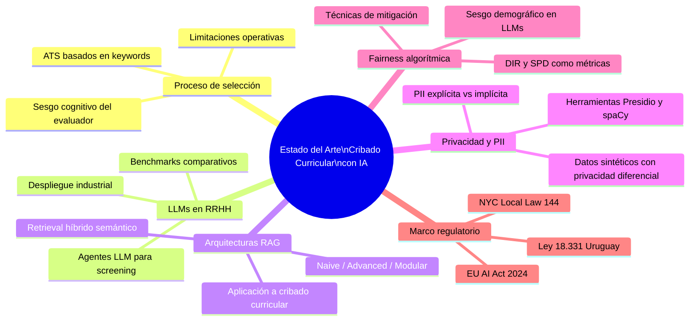
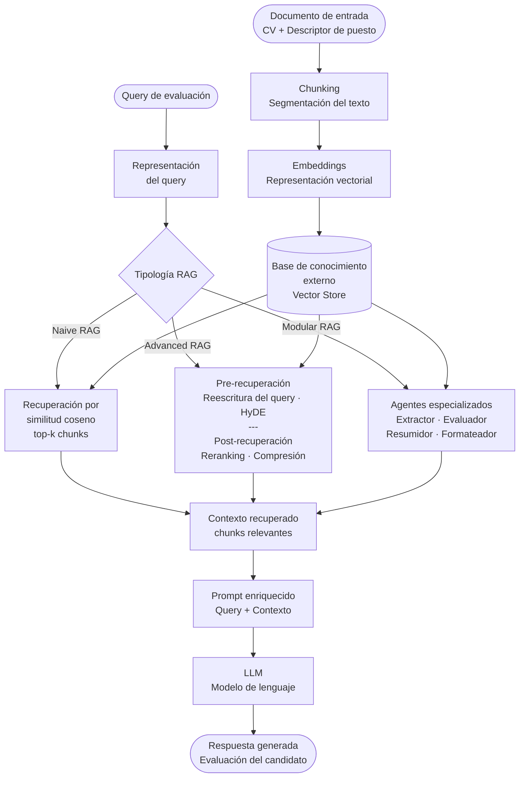
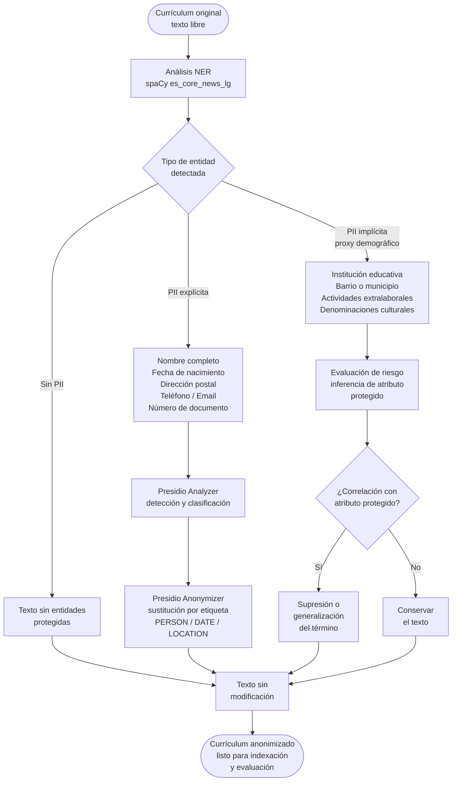

# 2. Estado del arte y fundamentos teóricos

El cribado automatizado de candidatos ocupa hoy un lugar central en la agenda de investigación sobre inteligencia artificial aplicada a la gestión de personas, impulsado por la convergencia de tres fenómenos simultáneos: el crecimiento sostenido del volumen de candidaturas que las organizaciones deben procesar, la maduración técnica de los modelos de lenguaje de gran escala y la proliferación de marcos regulatorios que exigen transparencia y equidad en los sistemas de selección automatizada. En este contexto, el presente capítulo sistematiza la evidencia académica y técnica que fundamenta el diseño de un sistema de preselección basado en recuperación aumentada y la formulación de sus hipótesis, organizando la revisión en seis áreas temáticas que abarcan desde las limitaciones documentadas del proceso manual hasta los marcos regulatorios vigentes, incorporando los fundamentos de las tecnologías centrales del dominio —LLMs, arquitecturas RAG y técnicas de anonimización— y el estado del conocimiento sobre equidad algorítmica en sistemas de contratación automatizada. La Figura 2.1 sintetiza la estructura de la revisión y la relación entre las áreas cubiertas.

*Figura 2.1. Mapa temático del estado del arte en cribado curricular con inteligencia artificial. Fuente: elaboración propia.*

## 2.1. El proceso de selección y sus limitaciones

El cribado curricular (*resume screening*) constituye la primera etapa de filtrado en cualquier proceso de selección de personal, cuya función es reducir el conjunto inicial de candidaturas a un subconjunto manejable para una evaluación más profunda; en organizaciones que reciben un volumen elevado de postulaciones, esta etapa determina qué candidatos llegan a ser considerados para el puesto y cuáles son descartados sin revisión adicional.

La revisión manual de currículums presenta limitaciones documentadas en tres dimensiones. En la dimensión operativa, el proceso impone una carga de trabajo que se degrada de forma marcada cuando el volumen de candidaturas supera la capacidad del equipo de selección, generando ineficiencias sistemáticas, retrasos en la evaluación y un mayor riesgo de error en la identificación de candidatos cualificados (Abhishek et al., 2025). Esta limitación estructural adquiere particular relevancia en contextos de alta demanda: organizaciones de escala global han debido destinar entre cuatro y seis meses a la revisión de cientos de miles de solicitudes para cubrir un número reducido de posiciones, absorbiendo decenas de miles de horas de trabajo humano que la automatización posterior permitió recuperar (Marr & Ward, 2019). Estos cuellos de botella dilatan el tiempo de contratación (*time-to-hire*) y aumentan el riesgo de descartar talento cualificado por fatiga decisional o error humano en las etapas iniciales.

En la dimensión técnica, el proceso manual penaliza perfiles no convencionales cuyas competencias no se ajustan al vocabulario del descriptor del puesto, produciendo falsos negativos que resultan indetectables e inauditables. Adicionalmente, la revisión humana es inherentemente inconsistente: la fiabilidad inter-evaluador en el cribado curricular se sitúa entre el 60 % y el 70 %, lo que implica que un mismo candidato puede recibir decisiones distintas dependiendo del evaluador asignado (Vanetik & Kogan, 2023).

En la dimensión ética, los sesgos cognitivos del evaluador contaminan sistemáticamente las decisiones de preselección: el *affinity bias* (tendencia a favorecer candidatos percibidos como similares al evaluador), el *halo effect* (influencia desproporcionada de una característica positiva sobre la valoración global) y el *primacy effect* (peso excesivo de la información leída en primer lugar) producen patrones de discriminación difícilmente controlables sin instrumentación específica (Thomas & Reimann, 2023). En un entorno público y regulado, donde la transparencia y la no discriminación son imperativos éticos, normativos e institucionales, esta opacidad del proceso manual representa un riesgo organizacional de primera magnitud.

Para aliviar la carga operativa, las organizaciones adoptaron históricamente los sistemas de seguimiento de candidatos (ATS, *Applicant Tracking Systems*) basados en coincidencia de palabras clave (*keyword matching*). Sin embargo, estos sistemas introducen sus propias distorsiones: penalizan candidatos cualificados que no han optimizado sus CVs para el sistema y no incorporan razonamiento semántico sobre competencias equivalentes o transferibles (González-González & Herrera, 2025). La investigación de Liu (2025) cuantificó esta limitación con precisión, demostrando que los sistemas basados en TF-IDF (que constituye el fundamento técnico de los ATS por coincidencia de términos) alcanzan un F₁-score de 0,716 en tareas de emparejamiento candidato-puesto, frente a 0,910 obtenido por arquitecturas de *transformers* sobre el mismo conjunto de 50.000 pares.

## 2.2. LLMs aplicados a RRHH y ATS inteligentes

La irrupción de los modelos de lenguaje de gran escala (LLMs, *Large Language Models*) ha abierto una vía cualitativamente distinta para el cribado curricular: a diferencia de los sistemas ATS basados en coincidencia léxica, los LLMs son capaces de razonar semánticamente sobre las competencias descritas en un currículum, interpretar equivalencias funcionales entre denominaciones de puestos distintas y evaluar el ajuste candidato-puesto en términos de capacidades y no solo de vocabulario.

Gan et al. (2024) presentaron uno de los primeros marcos de referencia para la aplicación de agentes LLM al cribado curricular, reportando un F₁-score de 87,73 % en clasificación de oraciones de currículum y una velocidad de procesamiento once veces superior a la del proceso manual. Liu (2025) amplió el análisis comparativo con un estudio sistemático sobre 50.000 pares currículum-puesto, documentando una jerarquía clara de rendimiento: TF-IDF (F₁ = 0,716) < Word2Vec (0,757) < LSTM (0,824) < BERT base (0,866) < BERT *dual-tower* (0,910). Bevara et al. (2025) confirmaron que las arquitecturas de *embeddings* semánticos superan a los ATS convencionales en un 15,85 % en nDCG (*Normalized Discounted Cumulative Gain*), la métrica estándar para evaluar la calidad del ranking de candidatos.

En el contexto industrial, Fu et al. (2025) reportaron el único despliegue a escala de un sistema de este tipo en producción: LANTERN, desarrollado por LinkedIn mediante destilación de LLMs, logró un incremento del 0,24 % en la tasa de aplicación y del 0,28 % en las aplicaciones cualificadas en condiciones reales de operación. Lavi et al. (2021) demostraron, con el modelo conSultantBERT entrenado sobre 270.000 pares reales y validado en producción en contexto multilingüe, que la adaptación de modelos de *embeddings* al dominio organizacional específico produce mejoras consistentes y sostenidas en la calidad del *matching*. La revisión sistemática de Dasaklis et al. (2025) sobre 75 artículos en LLMs aplicados a gestión de recursos humanos confirmó que el campo evoluciona con rapidez, pero carece aún de *benchmarks* consolidados y de marcos de evaluación estandarizados que permitan la comparación directa entre sistemas.

## 2.3. Arquitecturas RAG

Las arquitecturas de recuperación aumentada con generación (RAG, *Retrieval-Augmented Generation*) representan una extensión del paradigma LLM que incorpora un mecanismo de búsqueda semántica sobre una base de conocimiento externa antes de que el modelo genere su respuesta; en lugar de depender exclusivamente del conocimiento paramétrico adquirido durante el preentrenamiento, un sistema RAG recupera dinámicamente fragmentos de documentos relevantes (denominados *chunks*) y los incluye en el contexto del *prompt* que se envía al LLM.

Esta capacidad resulta especialmente valiosa en contextos organizacionales especializados donde el modelo base carece del conocimiento institucional necesario para evaluar competencias con precisión: al incorporar descriptores de puesto, taxonomías de competencias y criterios de evaluación corporativos en la base de conocimiento externa, el sistema puede contextualizar sus decisiones sin necesidad de reentrenamiento del modelo ni de exposición de datos sensibles a servicios externos, lo que adquiere mayor pertinencia en organizaciones del sector público o regulado donde la confidencialidad de la información de los candidatos está sujeta a requisitos normativos que limitan la transferencia de datos a plataformas de terceros.

La aplicación de arquitecturas RAG al cribado curricular constituye un área naciente con apenas dos o tres artículos revisados por pares (Dasaklis et al., 2025). Lo et al. (2025) presentaron el primer *framework* multi-agente RAG-LLM para *screening* curricular, con cuatro agentes especializados (extractor, evaluador, resumidor y formateador) y capacidades de explicabilidad (XAI) en las decisiones. Afzal et al. (2025) compararon RAG contra reconocimiento de entidades nombradas (NER) para el emparejamiento de perfiles técnicos usando el modelo Mixtral-8x22B y la taxonomía de competencias ESCO, encontrando que RAG superó significativamente a NER en las tareas de recuperación y que el uso de datos sintéticos en la validación produjo resultados comparables a los obtenidos con datos reales.

Las tipologías de RAG disponibles en la literatura varían en complejidad y estrategia de recuperación. El RAG básico (*Naive RAG*) indexa documentos mediante *embeddings* densos por similitud coseno y recupera los *k* fragmentos más cercanos al *query* de entrada. El RAG avanzado (*Advanced RAG*) incorpora estrategias de pre-recuperación (reescritura del *query* y HyDE, *Hypothetical Document Embeddings*) y de post-recuperación (reranking con *cross-encoders* y compresión de contexto) para mejorar la relevancia de los fragmentos recuperados. El RAG modular (*Modular RAG*) permite la composición flexible de los componentes del *pipeline*, habilitando la incorporación de agentes especializados para tareas específicas del dominio. La Figura 2.2 ilustra el flujo base compartido por las tres tipologías y sus puntos de diferenciación.

*Figura 2.2. Tipologías de arquitecturas RAG aplicadas al cribado curricular: flujo base y variantes según complejidad de recuperación. Fuente: elaboración propia a partir de Lewis et al. (2020) y Dasaklis et al. (2025).*

## 2.4. Privacidad de datos e información personal identificable (PII)

Los currículums contienen, por naturaleza, información personal identificable (PII, *Personally Identifiable Information*) en dos modalidades con implicaciones distintas para los sistemas de procesamiento automatizado. La PII explícita comprende atributos directamente identificadores: nombre completo, género declarado, fecha de nacimiento, dirección postal, fotografía, número de documento de identidad y datos de contacto. La PII implícita, o indirecta, comprende atributos que no son identificadores directos pero correlacionan estadísticamente con características protegidas: la institución educativa de procedencia puede correlacionar con nivel socioeconómico; las actividades deportivas o culturales mencionadas, con género o etnia; la denominación de barrios o municipios, con origen étnico o situación económica.

Esta distinción es crítica para el diseño de sistemas de anonimización porque las técnicas estándar de supresión y enmascaramiento de entidades (nombre, dirección, fecha de nacimiento) eliminan la PII explícita pero dejan intacta la PII implícita. La evidencia de Staab et al. (2023) confirmó que los modelos de lenguaje pueden inferir atributos protegidos a través de los *proxies* demográficos presentes en el texto aunque los identificadores directos hayan sido eliminados, lo que establece la necesidad de evaluar empíricamente la efectividad real de la anonimización textual como mecanismo de mitigación de sesgo en sistemas que operan sobre texto curricular.

Entre las herramientas disponibles para la detección y supresión de PII en texto libre, spaCy con sus modelos de reconocimiento de entidades nombradas (NER, *Named Entity Recognition*) y Microsoft Presidio constituyen las opciones más consolidadas en la literatura aplicada. Presidio es un *framework* especializado que permite la definición de entidades personalizadas para contextos lingüísticos específicos, extendiendo su aplicabilidad más allá de los identificadores estándar del inglés hacia variantes regionales y formas de designación propias de otros sistemas legales y culturales. Ambas herramientas implementan una estrategia de *debiasing* de preprocesamiento que actúa sobre los datos de entrada antes de su procesamiento por el modelo, siguiendo el precedente metodológico establecido por Deshpande et al. (2020) mediante el desarrollo de *fair-tf-idf*, un método de preprocesamiento que mitiga el sesgo sociolingüístico en sistemas de filtrado de currículums. La Figura 2.3 ilustra el flujo completo de detección y supresión de PII sobre texto curricular.

*Figura 2.3. Flujo de detección y supresión de información personal identificable en texto curricular mediante spaCy y Microsoft Presidio. Fuente: elaboración propia a partir de Deshpande et al. (2020) y Staab et al. (2023).*

La generación de datos sintéticos con garantías de privacidad diferencial representa la estrategia óptima para el desarrollo y validación de sistemas en contextos donde los datos reales no pueden ser exportados fuera de la organización. Bruera et al. (2022) propusieron el *pipeline* más riguroso disponible: extracción de atributos estadísticos de CVs reales, aprendizaje de dependencias condicionales mediante PrivBayes (una red bayesiana con garantías de privacidad diferencial) y generación de texto con modelos de lenguaje usando los atributos muestreados; aplicado sobre aproximadamente 28.000 currículums reales, este *pipeline* demostró que los modelos entrenados con datos sintéticos mantienen un rendimiento comparable al de los modelos entrenados con datos reales. Skondras et al. (2023) confirmaron que una mezcla de 60 % de datos reales con 40 % de datos sintéticos logra un 92 % de exactitud con BERT. Saldivar et al. (2025) construyeron el conjunto de *benchmarking* más actualizado para evaluaciones de equidad: 1.730 currículums sintéticos con atributos demográficos controlados, generados siguiendo explícitamente las recomendaciones del Artículo 10.5.a del Reglamento de IA de la Unión Europea para la detección de sesgos.

## 2.5. Fairness algorítmica en sistemas de selección

La *fairness* algorítmica en sistemas de selección de personal ha emergido como uno de los problemas abiertos más activos en la intersección entre la inteligencia artificial aplicada y la ética organizacional; la evidencia empírica acumulada en los últimos cinco años documenta la presencia de sesgos demográficos significativos en sistemas de selección automatizados, desde los ATS basados en palabras clave hasta los sistemas más recientes basados en LLMs.

Raghavan et al. (2020) realizaron el primer análisis sistemático de las prácticas de auditoría en la industria de herramientas de contratación automatizada, examinando dieciocho proveedores comerciales, y sus hallazgos revelaron que la mayoría no divulga información detallada sobre los métodos de validación de equidad de sus sistemas y que las definiciones de *fairness* empleadas son inconsistentes entre proveedores. Este trabajo seminal consolidó el Disparate Impact Ratio (DIR), métrica definida en los marcos regulatorios de igualdad de oportunidades en el empleo como el cociente entre la tasa de selección del grupo menos favorecido y la del grupo más favorecido, adoptando como umbral de no discriminación que dicho cociente no sea inferior al 80 % (U.S. Equal Employment Opportunity Commission, 1978; Ley N.° 16.045, 1989), como la métrica dominante en evaluaciones legales y regulatorias.

La evidencia sobre el sesgo específico de los LLMs en contextos de selección de personal es particularmente significativa. Wilson y Caliskan (2024) evaluaron tres modelos de lenguaje de código abierto sobre más de tres millones de comparaciones de currículums, encontrando que los modelos favorecieron nombres asociados a personas blancas en el 85,1 % de los casos y mostraron sesgos interseccionales significativos por género y etnia. El *benchmark* JobFair de Holistic AI extendió estos hallazgos a modelos de última generación, incluyendo GPT-4o, Gemini-1.5-flash y Claude-3-Haiku, documentando que todos incumplieron el umbral DIR ≥ 0,8 para el impacto por género. An et al. (2025) realizaron el análisis más exhaustivo disponible sobre este tema, evaluando 24 LLMs en tareas de evaluación curricular con 1.116 CVs reales anotados por expertos, y encontraron sesgos estadísticamente significativos en 19 de los 24 modelos evaluados; su análisis reveló que la magnitud del sesgo varía con el tamaño del modelo y la estrategia de *prompting*, pero no desaparece al aumentar la escala.

Respecto a los métodos de mitigación, Ip (2025) realizó una comparación experimental de tres familias de *debiasing* (preprocesamiento, modificación del proceso de inferencia y postprocesamiento), encontrando que las técnicas de paridad estadística maximizan la diversidad de los candidatos seleccionados pero no tratan la causa raíz del sesgo. Albaroudi et al. (2025) presentaron el antecedente más directo en esta línea: el modelo HITHIRE basado en Llama 3.1 con aumentación de datos (*data augmentation*) demostró reducciones significativas en el SPD y el DIR en evaluaciones de sesgo interseccional. Sin embargo, ninguno de los estudios revisados evalúa si la anonimización de PII como estrategia de preprocesamiento reduce el sesgo en sistemas de *screening* basados en LLMs o en *pipelines* RAG; toda la evidencia existente sobre los efectos de la anonimización en los resultados de selección corresponde a experimentos con revisores humanos (Raghavan et al., 2020).

## 2.6. Marco regulatorio y ético

La regulación de los sistemas de inteligencia artificial aplicados a la selección de personal se encuentra en un momento de consolidación normativa acelerada, con implicaciones directas para el diseño, despliegue y auditoría de cualquier herramienta automatizada de cribado.

El Reglamento de Inteligencia Artificial de la Unión Europea (Reglamento 2024/1689, EU AI Act), vigente desde agosto de 2024 y plenamente ejecutable en su capítulo sobre sistemas de alto riesgo desde agosto de 2026, clasifica los sistemas de IA utilizados para la contratación o selección de personas físicas como sistemas de alto riesgo bajo el Artículo 6(2) y el Anexo III, lo que implica requisitos obligatorios de supervisión humana (Art. 14), transparencia hacia los candidatos afectados (Art. 86), evaluaciones de impacto previas al despliegue compatibles con el GDPR (Art. 35) y monitoreo continuo del comportamiento del sistema en producción. El incumplimiento puede acarrear sanciones de hasta 35 millones de euros o el 7 % de la facturación global anual; el Artículo 10.5.a, que recomienda el uso de datos sintéticos para la detección de sesgos en sistemas de alto riesgo, tiene implicaciones metodológicas directas para el diseño de estudios de validación en este dominio.

En los Estados Unidos, la Local Law 144 de la ciudad de Nueva York (2023) exige que las empresas que utilicen herramientas ATS automatizadas realicen auditorías anuales de sesgo por terceros independientes y las divulguen públicamente. La jurisprudencia reciente en torno a casos de presunta discriminación algorítmica, documentada y analizada por Goodman (2025), revela la tendencia de los tribunales a exigir transparencia en los procesos de selección automatizada, lo que amplía el contexto regulatorio más allá de las normas administrativas.

En Uruguay, la Ley 18.331 de Protección de Datos Personales (2008) establece restricciones específicas sobre el tratamiento de datos que permiten la identificación directa o indirecta de las personas, con implicaciones directas para el diseño de cualquier sistema de IA que opere sobre currículums; su artículo 18 exige que el responsable del tratamiento adopte medidas técnicas y organizativas adecuadas para garantizar la seguridad de los datos y evitar su alteración, pérdida o acceso no autorizado.

Para la gestión de la colaboración universidad-empresa en este contexto, el Five Safes Framework (Desai et al., 2016) ofrece el esquema más comprehensivo, articulado en cinco dimensiones: proyectos seguros (gobernanza institucional y aprobación ética), personas seguras (formación de investigadores en manejo de datos sensibles), entornos seguros (cómputo controlado en la infraestructura de la empresa), datos seguros (des-identificación previa a cualquier acceso) y resultados seguros (revisión de divulgación antes de la publicación).

## 2.7. Análisis crítico y brecha de investigación

La revisión presentada en este capítulo permite identificar tres brechas convergentes en el estado del conocimiento, cuya confluencia justifica el diseño experimental adoptado en el presente trabajo.

La primera es de naturaleza cuantitativa: la aplicación de arquitecturas RAG al cribado curricular cuenta con apenas dos o tres artículos *peer-reviewed* (Dasaklis et al., 2025), ninguno de los cuales compara RAG contra BERT *fine-tuned* y contra *keyword matching* sobre el mismo *dataset* y con las mismas métricas; no existe estudio publicado que aísle el efecto específico de la recuperación aumentada sobre la eficacia del cribado curricular respecto a un LLM puro, controlando el modelo base y el corpus de evaluación, lo que configura una dirección de investigación sin respuesta empírica consolidada. La segunda brecha, de naturaleza cualitativa, es aún más pronunciada: no existe ningún estudio que evalúe si la anonimización de PII reduce el sesgo algorítmico en sistemas de *screening* basados en LLMs o en arquitecturas RAG, ya que toda la evidencia disponible sobre los efectos de la anonimización en los resultados de selección corresponde a experimentos con revisores humanos (Raghavan et al., 2020); aunque los estudios de Wilson y Caliskan (2024) y An et al. (2025) han demostrado que los LLMs exhiben sesgos masivos y sistemáticos, ninguno ha evaluado si la supresión de PII explícita en los CVs de entrada reduce esos sesgos de forma estadísticamente significativa, aislando su contribución de la de la arquitectura RAG. La tercera brecha, de naturaleza geográfica y regulatoria, cierra el cuadro: no existe literatura académica empírica sobre sistemas de IA para reclutamiento en el contexto latinoamericano (Bangura et al., 2025), ni sobre la aplicación de la Ley 18.331 de Uruguay en este dominio.

La Tabla 2.1 sintetiza los veintitrés trabajos más relevantes identificados en la revisión, organizados por área temática e indicando su relación con las hipótesis del trabajo.

**Tabla 2.1.** Síntesis de la literatura relevante para el presente trabajo.

*Fuente: Elaboración propia a partir de la revisión de literatura.*

## 2.8. Conclusiones del estado del arte

La revisión presentada en este capítulo permite establecer tres conclusiones que fundamentan el diseño del experimento y la formulación de sus hipótesis.

La superioridad técnica de los LLMs y las arquitecturas RAG respecto a los sistemas ATS tradicionales está sólidamente demostrada; los *benchmarks* disponibles, con F₁-scores de hasta 0,910 en las arquitecturas más avanzadas y velocidades de procesamiento once veces superiores al proceso manual, confirman que los umbrales propuestos en la literatura para tareas de clasificación binaria de candidatos son técnicamente alcanzables. No obstante, la aplicación específica de RAG al cribado curricular carece aún de estudios comparativos directos que aíslen su contribución respecto a los LLMs puros, lo que deja abierta una pregunta empírica relevante para el diseño de sistemas de selección eficaces.

La evidencia sobre el sesgo sistemático de los LLMs en contextos de selección de personal es inequívoca: los estudios de Wilson y Caliskan (2024) y An et al. (2025) documentan sesgos de magnitud preocupante que afectan a todos los modelos de lenguaje evaluados, mientras que los trabajos de Albaroudi et al. (2025) e Ip (2025) demuestran que las técnicas de mitigación pueden reducirlos significativamente en condiciones controladas. La eficacia de la anonimización de PII como mecanismo de *debiasing* específico en sistemas LLM con RAG no ha sido evaluada empíricamente por ningún estudio previo, lo que configura una zona de conocimiento abierta con implicaciones directas para el diseño de sistemas de selección equitativos en contextos regulados.

El contexto latinoamericano y el marco regulatorio uruguayo representan un vacío activo en la literatura académica sobre IA aplicada al reclutamiento; la ausencia de investigación empírica en esta región, combinada con los requisitos específicos de la Ley 18.331, configura un escenario de doble pertinencia académica y práctica que justifica tanto el enfoque experimental adoptado como el uso de un corpus sintético diseñado para preservar la representatividad del contexto rioplatense sin comprometer la protección de datos de los candidatos reales.
