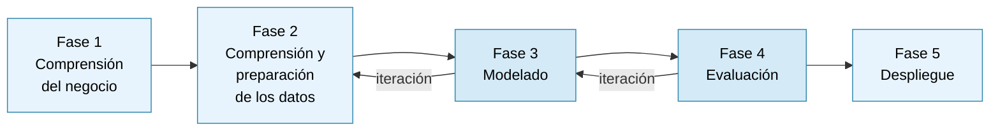

# 3. Objetivos y metodología de trabajo

A partir de las brechas identificadas en el estado del arte, este capítulo define el objetivo general del trabajo, los objetivos específicos que lo operacionalizan y la estrategia metodológica adoptada para su consecución; sirve así de puente entre el diagnóstico del problema y el diseño de la solución desarrollada.

## 3.1. Objetivo general

El objetivo general del presente trabajo es evaluar el efecto diferencial de incorporar recuperación semántica aumentada y anonimización de información personal identificable en un sistema de preselección curricular basado en modelos de lenguaje de gran escala, mediante un estudio piloto controlado sobre un corpus sintético, con el fin de generar evidencia cuantitativa sobre el impacto de cada componente en la eficiencia del proceso, la calidad técnica de las decisiones de preselección y la equidad algorítmica de los resultados, en un contexto operativo representativo del sector de servicios compartidos en Uruguay. Este objetivo responde directamente a la ausencia de evidencia empírica desagregada por componente tecnológico identificada en la literatura, particularmente en el contexto latinoamericano y bajo marcos regulatorios como el uruguayo.

## 3.2. Objetivos específicos

Para alcanzar el objetivo general, se han definido los siguientes objetivos específicos:

**[OE1] Construir** un corpus sintético de pares currículum–descripción de puesto en español, con atributos demográficos controlados, garantizando un mínimo de 300 pares distribuidos equilibradamente entre perfiles técnicos y administrativos representativos del dominio energético.

**[OE2] Implementar** el pipeline de recuperación semántica aumentada sobre el corpus generado, evaluando su desempeño mediante recall@10 con un umbral de referencia de 0,80.

**[OE3] Desarrollar** el módulo de detección y supresión de información personal identificable, adaptado al contexto lingüístico rioplatense, con una precisión y recall de referencia ≥ 0,95 sobre entidades explícitas.

**[OE4] Construir** el Gold Standard conformando un panel de entre tres y cinco evaluadores con experiencia en selección de personal, obteniendo etiquetas de idoneidad binaria sobre una submuestra estratificada de entre 120 y 150 currículums sintéticos y verificando el acuerdo inter-evaluador mediante el coeficiente κ de Cohen con un umbral mínimo de 0,70.

**[OE5] Ejecutar** el estudio comparativo procesando el corpus bajo las cuatro condiciones de procesamiento, registrando para cada candidato el tiempo de procesamiento, el score asignado y la decisión binaria, y asegurando la trazabilidad completa de las variables del diseño.

**[OE6] Calcular** el Disparate Impact Ratio (DIR) y la diferencia de paridad estadística (SPD, *Statistical Parity Difference*) para cada condición, desagregando los resultados por género y rango de edad, y contrastar estadísticamente las diferencias entre condiciones.

## 3.3. Metodología de trabajo

El presente trabajo adopta el proceso estándar para minería de datos CRISP-DM (*Cross-Industry Standard Process for Data Mining*) como marco metodológico, por ser el estándar más extendido en proyectos de ciencia de datos aplicada (Schröer et al., 2021) y porque su fase de comprensión del negocio permite vincular con naturalidad el desarrollo técnico del sistema con los requisitos operativos de la organización colaboradora; su naturaleza cíclica resulta además especialmente adecuada para el ajuste iterativo de sistemas basados en modelos de lenguaje (Chapman et al., 2000).

El modelo original contempla seis fases; en el presente trabajo se adopta una versión adaptada de cinco, ajustada al horizonte temporal disponible y a las restricciones del diseño piloto con datos sintéticos. La Tabla 3.1 resume cada fase, sus actividades principales y su correspondencia con los objetivos específicos.

**Tabla 3.1.** *Adaptación de CRISP-DM al presente trabajo.*

| Fase | Denominación | Actividades principales | OE asociado |
|------|-------------|------------------------|-------------|
| 1 | Comprensión del negocio | Relevamiento del proceso de selección en Matriz; identificación de perfiles de cargo; definición de criterios de idoneidad | — |
| 2 | Comprensión y preparación de los datos | Generación del corpus sintético; análisis de distribuciones demográficas; diseño del protocolo de etiquetado | OE1, OE4 |
| 3 | Modelado | Implementación del pipeline de recuperación semántica; implementación del módulo de anonimización; configuración del motor de scoring | OE2, OE3 |
| 4 | Evaluación | Ejecución del estudio comparativo; cálculo de métricas de eficacia, eficiencia y equidad; validación estadística de las diferencias | OE5, OE6 |
| 5 | Despliegue | Documentación de resultados; elaboración de recomendaciones para la organización; identificación de líneas de trabajo futuro | — |

*Fuente: elaboración propia, adaptado de Chapman et al. (2000).*

Las fases 3 y 4 presentan una dependencia secuencial que constituye el principal riesgo de cronograma: la evaluación no puede iniciarse hasta que el corpus esté generado y validado y los módulos del sistema estén operativos. Esta dependencia se gestiona mediante el control de versiones descrito en la organización del trabajo.

**Figura 3.1.** *Adaptación de CRISP-DM al presente trabajo. Fuente: elaboración propia.*

