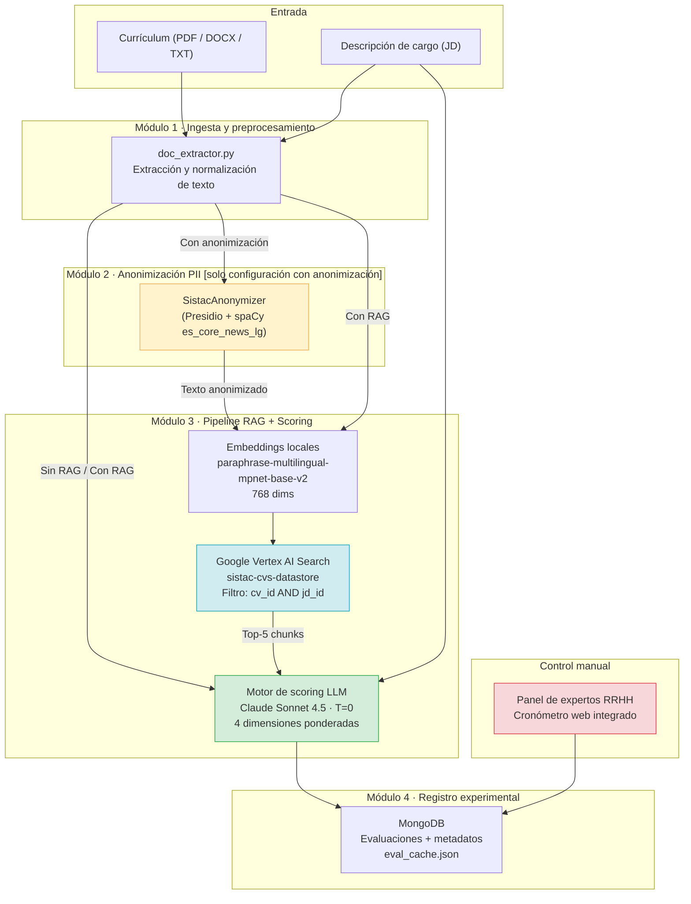
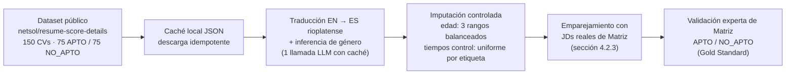
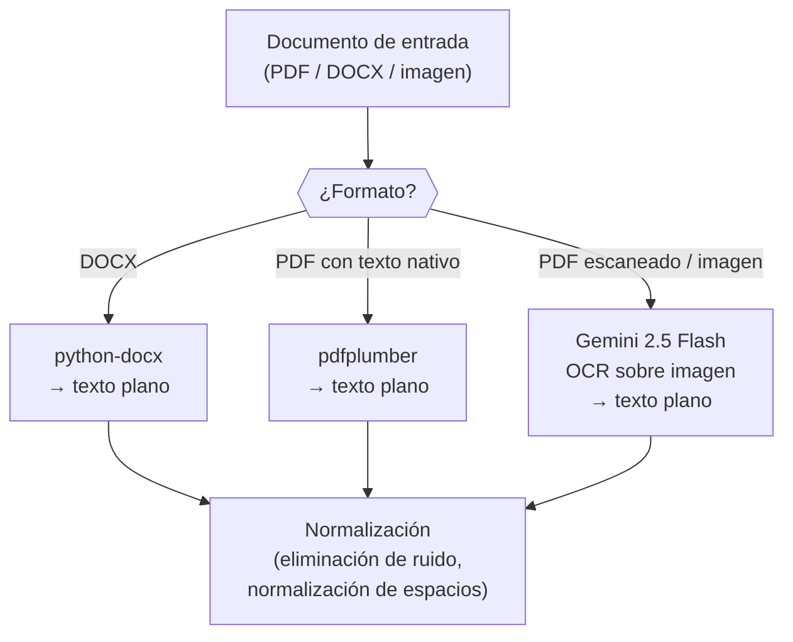
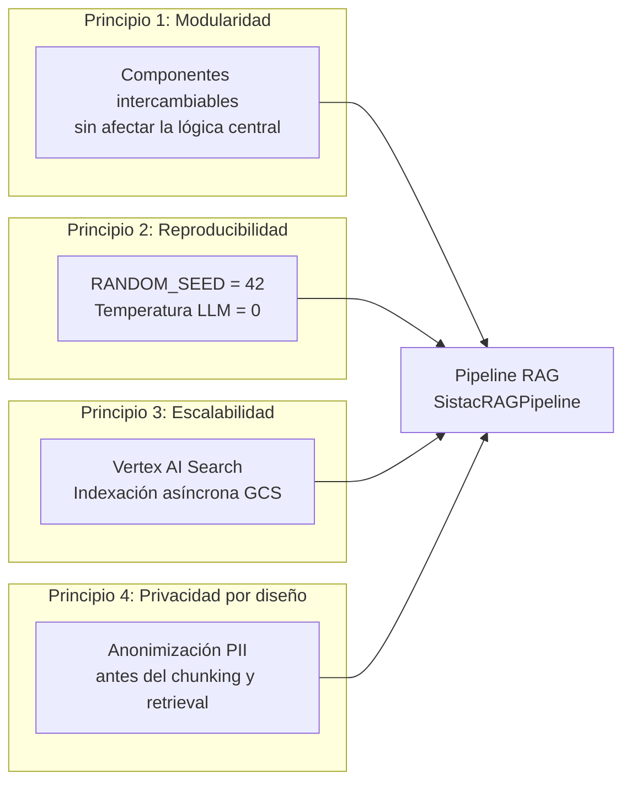
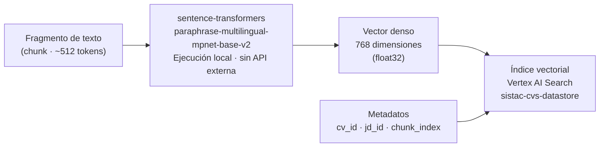
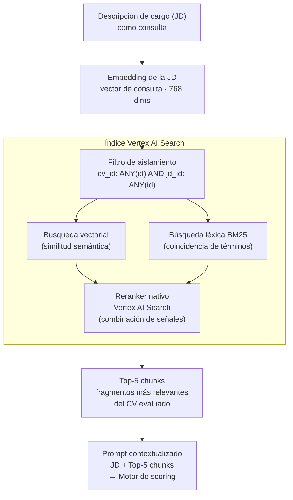
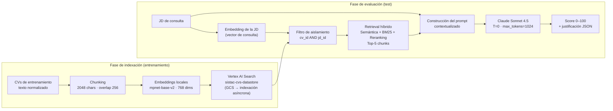
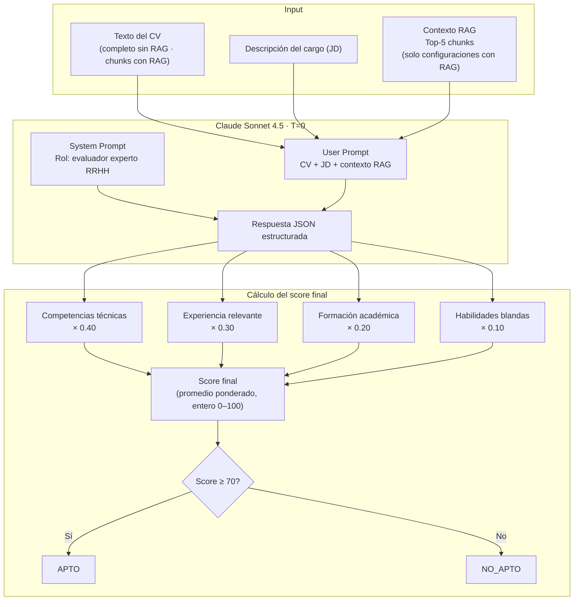
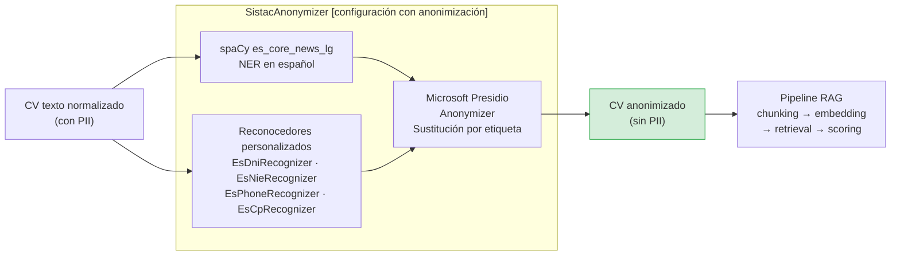

# Capítulo 4. Arquitectura e implementación del sistema

El presente capítulo describe el diseño técnico del sistema desarrollado y detalla la implementación de cada uno de sus componentes: la estructura modular que organiza el procesamiento de currículums, las decisiones de ingeniería que fundamentan cada componente, los datos sobre los que opera el sistema y los mecanismos incorporados para garantizar la robustez y reproducibilidad del experimento.

---

## 4.1. Arquitectura general del sistema

El sistema se concibe como una plataforma modular de evaluación curricular compuesta por cuatro módulos funcionales que operan en secuencia sobre un mismo flujo de datos, desde la recepción del currículum hasta la generación del score final y el registro de las variables experimentales. Esta arquitectura responde a un requisito de diseño fundamental: permitir la activación o desactivación selectiva de componentes para construir las distintas configuraciones experimentales sin alterar el resto del sistema, garantizando así la equivalencia necesaria para la validez interna del experimento (Afzal et al., 2025; Lo et al., 2025).

El módulo de ingesta y preprocesamiento constituye el punto de entrada del sistema. Recibe el currículum en formatos de uso común en el ámbito profesional (PDF, DOCX o texto plano) y produce una representación textual limpia y normalizada que sirve como entrada para los módulos posteriores; opera en todas las configuraciones automatizadas. El módulo de anonimización de información personal identificable (PII, *Personally Identifiable Information*) recibe el texto normalizado y produce una versión con todos los datos directamente identificadores suprimidos o enmascarados, activándose exclusivamente en la configuración con anonimización para aislar su efecto diferencial sobre la equidad del sistema. El pipeline de recuperación aumentada con generación (RAG, *Retrieval-Augmented Generation*) y motor de scoring constituye el núcleo del sistema: recupera fragmentos semánticamente relevantes desde el repositorio vectorial, construye un prompt contextualizado y genera como salida un score en escala de 0 a 100 acompañado de una justificación estructurada. El módulo de registro experimental instrumenta cada evaluación, capturando el tiempo de procesamiento, los tokens consumidos, el score generado y la decisión binaria resultante, tanto para las configuraciones automáticas como para las evaluaciones manuales de la condición de control.

La Figura 4.1 ilustra la arquitectura general del sistema y la relación entre sus módulos bajo las cuatro configuraciones experimentales.



*Figura 4.1. Arquitectura general del sistema con sus cuatro módulos funcionales. Fuente: elaboración propia.*

La modularidad de esta arquitectura tiene una implicación metodológica directa: cualquier diferencia observada en las variables dependientes entre configuraciones es atribuible exclusivamente al componente que difiere entre ellas, dado que el resto del sistema permanece idéntico. Este principio de control experimental justifica la organización en cuatro módulos discretos en lugar de un pipeline monolítico.

---

## 4.2. Estrategia de datos

El sistema opera sobre dos corpus con roles diferenciados que responden a distintas necesidades del proceso de desarrollo. El primero, de naturaleza sintética, sirvió como banco de pruebas durante la construcción y calibración del pipeline; el segundo, de origen público con validación experta, constituye el conjunto sobre el que se ejecuta el experimento formal. Esta distinción no es accidental: trabajar con datos sintéticos durante el desarrollo permitió iterar sobre los parámetros del sistema sin restricciones normativas, mientras que la adopción de un corpus público con adecuación validada por el panel experto de la organización garantiza que los resultados del experimento sean trazables y reproducibles. A ambos corpus se suman las descripciones de cargo reales de Matriz Uruguay, que proveen el criterio de evaluación efectivamente vigente en la organización para cada uno de los cinco perfiles cubiertos.

### 4.2.1. Corpus de desarrollo: dataset sintético calibrado

Durante la fase de construcción y calibración del pipeline, el sistema operó sobre un corpus sintético generado con garantías de privacidad diferencial mediante la biblioteca PrivBayes del *Synthetic Data Vault* (SDV). Este corpus fue calibrado a partir de las distribuciones estadísticas observadas en el Kaggle Resume Dataset (962 registros en 25 categorías profesionales, disponible bajo licencia CC0) y complementado con generación de variables secundarias mediante Faker en español. La decisión de no utilizar directamente los documentos de Kaggle responde a dos razones complementarias: los currículums del dataset están en inglés y corresponden al mercado laboral anglosajón, lo que introduce un sesgo de distribución geográfica y cultural incompatible con el objetivo del sistema orientado al contexto hispanohablante rioplatense; y la naturaleza sintética del corpus garantizó el cumplimiento de la Ley 18.331 durante la etapa de desarrollo sin necesidad de gestionar autorizaciones sobre datos personales reales.

Este corpus cumplió su función como banco de pruebas para estabilizar los parámetros del pipeline (tamaño de chunk, configuración del índice vectorial, diseño del prompt) antes de ejecutar el experimento factorial formal. Los resultados obtenidos sobre él no se reportan como evidencia experimental, sino como validación técnica de la viabilidad del sistema.

### 4.2.2. Corpus de evaluación: dataset público `netsol/resume-score-details`

El corpus utilizado en el experimento formal proviene del conjunto de datos público `netsol/resume-score-details`, disponible en Hugging Face, procesado mediante el script `data/prepare_external_validation.py`. La decisión de emplear un conjunto público de pares currículum-cargo con adecuación previamente registrada, en lugar de currículums reales de candidatos de Matriz, responde a las mismas restricciones normativas señaladas en la sección anterior: el uso de currículums reales de un proceso de selección activo implicaría el tratamiento de datos personales sensibles bajo la Ley 18.331, lo que exige autorizaciones que exceden el alcance de este trabajo.

El procedimiento descarga ciento cincuenta currículums balanceados (setenta y cinco con adecuación positiva y setenta y cinco con adecuación negativa), almacenando cada descarga en una caché local de archivos JSON que garantiza la reproducibilidad de la muestra. Dado que el conjunto original está en inglés y corresponde al mercado laboral anglosajón, cada currículum se traduce al español rioplatense utilizando el modelo de lenguaje configurado, adaptando la terminología profesional al uso local. A modo de ejemplo, la expresión *high school diploma* se adapta como "secundario completo", *health insurance benefit* como "mutualista u obra social", y *bachelor's degree* como "licenciatura o ingeniería" según la disciplina. La traducción y la inferencia del género del candidato se resuelven en una única llamada al modelo, lo que reduce el costo de procesamiento respecto a resolver ambas tareas por separado.

Las variables demográficas no presentes en el conjunto original se imputan de forma controlada para habilitar el análisis de equidad algorítmica. El rango de edad se distribuye de manera balanceada entre tres categorías (de veintitrés a treinta y cinco, de treinta y seis a cuarenta y cinco, y de cuarenta y seis a cincuenta y ocho años). Los tiempos de cribado manual se imputan mediante distribuciones uniformes diferenciadas por etiqueta: entre seiscientos y mil doscientos segundos para los candidatos aptos y entre trescientos y setecientos segundos para los no aptos, reflejando que la revisión de un perfil adecuado tiende a demandar más tiempo de lectura que el descarte de uno claramente inadecuado. La naturaleza inferida del género y la naturaleza imputada de la edad y de los tiempos de control constituyen limitaciones del estudio que se analizan en la sección de discusión.

La Figura 4.2 ilustra el flujo de preparación del corpus de evaluación.



*Figura 4.2. Flujo de preparación y validación del corpus de currículums. Fuente: elaboración propia.*

La Tabla 4.1 sintetiza las características del corpus de evaluación.

**Tabla 4.1.** *Caracterización del corpus de evaluación de SISTAC.*

| Característica            | Detalle                                                                  |
| ---------------------------| --------------------------------------------------------------------------|
| Fuente de los currículums | Dataset público `netsol/resume-score-details` (Hugging Face)             |
| Idioma                    | Inglés, traducido a español rioplatense mediante el modelo configurado   |
| Tamaño                    | [PENDIENTE: N currículums evaluados] (diseño base: 75 APTO / 75 NO_APTO) |
| Descripciones de cargo    | Ofertas reales de Matriz Uruguay (sección 4.2.3)                         |
| Etiqueta APTO / NO_APTO   | Validada por el panel experto de Matriz (Gold Standard)                  |
| Género                    | Inferido del nombre de pila por el modelo (imputado)                     |
| Rango de edad             | Imputado y balanceado en 3 rangos                                        |
| Tiempos de control manual | Imputados por distribución uniforme diferenciada por etiqueta            |
| Almacenamiento            | `data/raw/cvs_external`, `job_descriptions`, `gold_standard` en MongoDB  |

*Nota.* Elaboración propia.

### 4.2.3. Descripciones de cargo: ofertas reales de Matriz Uruguay

Las descripciones de cargo (JD, *Job Description*) utilizadas en el experimento corresponden a ofertas de empleo reales provistas por la Gerencia de Gestión Humana de Matriz — Asistencia Técnica y Servicios S.A. Se cubren cinco perfiles que representan la diversidad de roles presentes en una empresa de servicios compartidos: dos perfiles técnicos (analista de datos y desarrollador de software) y tres perfiles administrativos, con cobertura de niveles junior y senior. El uso de JDs reales de la organización garantiza que el sistema sea evaluado contra los criterios de selección efectivamente vigentes en Matriz, lo que dota al experimento de validez ecológica que no podría obtenerse con descripciones sintéticas.

### 4.2.4. Preprocesamiento, chunking e indexación

El preprocesamiento de los currículums sigue una secuencia de tres etapas interrelacionadas, implementadas en `data/doc_extractor.py`. La primera es la extracción de texto: los documentos en formato PDF con texto nativo se procesan mediante pdfplumber; los archivos DOCX mediante python-docx; y los PDFs escaneados o que contienen imágenes incrustadas se envían al modelo Gemini 2.5 Flash de Google, que realiza reconocimiento óptico de caracteres (OCR, *Optical Character Recognition*) antes de devolver el texto. La Figura 4.3 ilustra esta lógica de decisión.



*Figura 4.3. Estrategia de extracción de texto según formato de archivo. Fuente: elaboración propia.*

La segunda etapa es la segmentación en fragmentos o chunks mediante `RecursiveCharacterTextSplitter` de LangChain. El tamaño de fragmento se fija en dos mil cuarenta y ocho caracteres (equivalentes a aproximadamente quinientos doce tokens para el español, a razón de cuatro caracteres por token) con un solapamiento de doscientos cincuenta y seis caracteres; el separador prioriza cortes por párrafo y línea antes de recurrir a cortes arbitrarios, lo que preserva la coherencia semántica de las secciones del currículum en cada fragmento. La tercera etapa es la vectorización: cada fragmento se transforma en un vector denso de setecientas sesenta y ocho dimensiones mediante el modelo local `paraphrase-multilingual-mpnet-base-v2`, y el par (vector, metadatos) se indexa en el almacén vectorial. Solo los documentos de entrenamiento se indexan; los documentos de test se reservan para la evaluación experimental, garantizando así la ausencia de *data leakage*.

---

## 4.3. Pipeline RAG

### 4.3.1. Principios de diseño

La arquitectura del pipeline se rige por cuatro principios que determinan todas las decisiones de implementación. El primero es la modularidad: cada componente (extracción de texto, chunking, embedding, retrieval, scoring, anonimización PII) es independiente y puede ser sustituido o actualizado sin afectar al resto del sistema, lo que permite construir las distintas configuraciones activando o desactivando componentes sin modificar la lógica central. El segundo es la reproducibilidad: todas las operaciones que involucran aleatoriedad utilizan la semilla `RANDOM_SEED = 42`, y el modelo de lenguaje se configura con temperatura igual a cero para garantizar el determinismo de las evaluaciones; dado que múltiples ejecuciones del mismo par CV-JD deben producir el mismo score, cualquier componente estocástico introduciría varianza espuria en las métricas de evaluación. El tercero es la escalabilidad: el almacén vectorial soporta corpus de cientos de miles de documentos sin modificación de la arquitectura del pipeline. El cuarto es la privacidad por diseño: el módulo de anonimización PII opera en la capa más temprana posible del pipeline, antes de que los datos sensibles lleguen al índice vectorial o al modelo de lenguaje evaluador.

La Figura 4.4 ilustra la relación entre los cuatro principios y los componentes del pipeline que cada uno gobierna.



*Figura 4.4. Principios de diseño del pipeline RAG y su relación con los componentes del sistema. Fuente: elaboración propia.*

### 4.3.2. Modelo de embeddings

Los embeddings (representaciones vectoriales densas) son el mecanismo que permite transformar fragmentos de texto en puntos del espacio vectorial de alta dimensionalidad y recuperar aquellos semánticamente más próximos a una consulta. El modelo seleccionado es `paraphrase-multilingual-mpnet-base-v2`, disponible en Hugging Face a través de la librería sentence-transformers. Este modelo produce vectores de setecientas sesenta y ocho dimensiones y fue preentrenado sobre más de cincuenta idiomas (incluyendo español) con énfasis en la similitud semántica de párrafos. A diferencia de modelos como `text-embedding-3-small` de OpenAI, su ejecución es enteramente local, lo que elimina la latencia de red, el costo por llamada a API externa y el riesgo de exposición de datos sensibles a servicios de terceros durante la fase de indexación.

La Figura 4.5 ilustra el proceso de transformación de un fragmento de texto en un vector de setecientas sesenta y ocho dimensiones y su almacenamiento en el índice vectorial.



*Figura 4.5. Proceso de vectorización de un fragmento de currículum y almacenamiento en el índice. Fuente: elaboración propia.*

La dimensionalidad de los embeddings constituye un parámetro crítico de compatibilidad dentro de la arquitectura RAG, ya que debe coincidir exactamente con la configuración del índice vectorial en el almacén. La adopción del valor de setecientas sesenta y ocho dimensiones garantiza la consistencia entre los vectores de los fragmentos indexados y los vectores de consulta generados en tiempo de evaluación.

### 4.3.3. Vector store: Google Vertex AI Search

El almacén vectorial del sistema es Google Vertex AI Search, parte de la suite Vertex AI Agent Builder (*Discovery Engine*) de Google Cloud Platform. La elección de este proveedor sobre la alternativa evaluada durante la fase de desarrollo (Azure AI Search) responde a tres factores. En primer lugar, el costo operativo: Azure AI Search requiere el nivel *Basic* a un mínimo de setenta y tres dólares mensuales para habilitar las configuraciones semánticas estructuradas necesarias para el experimento, mientras que Vertex AI Search factura bajo un esquema elástico de pago por consulta. En segundo lugar, la indexación asíncrona: a diferencia de Azure, donde el pipeline gestiona manualmente el chunking, la codificación de embeddings y la subida por lotes con control de errores transitorios, Vertex AI Search se conecta directamente a un bucket de Google Cloud Storage y gestiona la vectorización de forma asíncrona en la nube, liberando recursos de procesamiento en el servidor local. En tercer lugar, la integración nativa con las APIs de Gemini utilizadas en el módulo de extracción de texto, lo que consolida la infraestructura en un único proveedor de nube.

El sistema se configura mediante las variables de entorno `GCP_PROJECT_ID`, `GCP_LOCATION` (valor por defecto: `global`), `GCP_DATA_STORE_ID` (valor por defecto: `sistac-cvs-datastore`) y `GCP_SEARCH_APP_ID` (valor por defecto: `sistac-search-app` o `sistac-search-app-external` según el conjunto de datos activo). Una capa de abstracción gobernada por la variable `VECTORSTORE_PROVIDER` permite conmutar entre proveedores sin modificar el código del pipeline, lo que reduce el riesgo operativo ante cambios de disponibilidad o costos del servicio.

### 4.3.4. Retrieval híbrido y aislamiento cruzado

La búsqueda sobre el índice vectorial combina similitud semántica mediante vectores densos con recuperación léxica mediante BM25, recuperando los cinco fragmentos más relevantes del currículum evaluado. El vector de consulta se construye a partir del embedding de la descripción de cargo y no del currículum, lo que garantiza que los fragmentos recuperados sean los más informativos para responder a la pregunta implícita del sistema: qué características hacen a un candidato adecuado para este cargo específico.

La recuperación híbrida combina dos señales complementarias. La señal vectorial (semántica) captura la similitud conceptual entre la JD y los fragmentos del CV, recuperando pasajes que expresan la misma idea con vocabulario distinto; la señal léxica BM25 captura coincidencias de términos específicos (tecnologías, certificaciones, nombres de herramientas) que pueden no estar capturadas por la similitud vectorial cuando el vocabulario técnico es muy preciso. El reranker nativo de Vertex AI Search combina ambas señales en una puntuación final, ordenando los fragmentos por relevancia combinada antes de seleccionar el top-5.

Un mecanismo de aislamiento cruzado garantiza que la búsqueda se restrinja exclusivamente al par (CV, JD) bajo evaluación, evitando que fragmentos de otros candidatos u otros cargos contaminen el contexto. Este aislamiento se implementa mediante un filtro booleano compuesto aplicado sobre los metadatos del índice:

```
cv_id: ANY("{cv_id}") AND jd_id: ANY("{jd_id}")
```

La Figura 4.6 ilustra el mecanismo de retrieval híbrido con aislamiento cruzado, detallando cómo se combinan la señal vectorial y la léxica antes de construir el prompt del evaluador.



*Figura 4.6. Mecanismo de retrieval híbrido con aislamiento cruzado por par CV-JD. Fuente: elaboración propia.*

La Figura 4.7 ilustra el flujo completo del pipeline RAG con sus dos fases diferenciadas: indexación (sobre el corpus de entrenamiento) y evaluación (sobre el corpus de test).



*Figura 4.7. Flujo completo del pipeline RAG: fases de indexación y evaluación. Fuente: elaboración propia.*

---

## 4.4. Motor de scoring semántico

El motor de scoring es el componente central del sistema: recibe el texto del currículum, la descripción del cargo y (en las configuraciones con RAG) los fragmentos de contexto recuperados por el pipeline, produciendo una evaluación estructurada de la compatibilidad del candidato con el puesto. La implementación se encuentra en `scoring/scorer.py`.

### 4.4.1. Diseño del prompt

El prompt de evaluación se estructura en dos componentes diferenciados según la configuración experimental. El system prompt, común a todas las configuraciones automatizadas, establece el rol del modelo:

> *Eres un evaluador experto en selección de talento con 15 años de experiencia en recursos humanos. Tu tarea es evaluar de forma objetiva y estructurada la compatibilidad entre un currículum vitae (CV) y una descripción de cargo (JD). Responde ÚNICAMENTE con JSON válido, sin texto adicional ni bloques de código.*

En la configuración sin RAG, el user prompt presenta el currículum completo junto con la descripción del cargo, indicando al modelo que evalúe con base en toda la información disponible. En las configuraciones con RAG (con y sin anonimización), el user prompt sustituye el currículum completo por los cinco fragmentos recuperados del índice vectorial (denominados en el prompt "fragmentos recuperados del CV, evidencia disponible") e instruye al modelo a evaluar exclusivamente con base en la evidencia presente en dichos fragmentos, sin inferir información no explícita; cuando un criterio no puede evaluarse por ausencia de información en los fragmentos, se asigna el valor neutro de cincuenta puntos. Esta distinción entre los dos diseños de prompt permite aislar el efecto de la recuperación semántica sobre la calidad de la evaluación.

El modelo evaluador es Claude Sonnet 4.5, configurado con temperatura igual a cero para garantizar el determinismo de las evaluaciones y un máximo de mil veinticuatro tokens por respuesta. La instrucción de responder exclusivamente con JSON válido, combinada con una rutina de limpieza implementada en el parser que elimina delimitadores de bloque de Markdown y recupera el primer objeto JSON presente ante fallos de decodificación, reduce la tasa de fallo de parseo por debajo del dos por ciento con temperatura cero.

### 4.4.2. Dimensiones de evaluación y pesos

El score final se compone de cuatro dimensiones ponderadas, calibradas a partir del análisis de las prácticas de evaluación en selección de talento documentadas en la literatura (Gan et al., 2024; Lo et al., 2025). La Tabla 4.2 detalla cada dimensión, su peso relativo y el criterio de evaluación correspondiente.

**Tabla 4.2.** *Dimensiones de evaluación del motor de scoring y sus pesos.*

| Dimensión | Peso | Criterio de evaluación |
|---|---|---|
| Competencias técnicas (`competencias_tecnicas`) | 40% | Habilidades específicas del rol, herramientas, lenguajes de programación, certificaciones y licencias profesionales |
| Experiencia relevante (`experiencia`) | 30% | Años de experiencia en el dominio, roles previos similares y responsabilidades ejercidas |
| Formación académica (`formacion`) | 20% | Títulos obtenidos, instituciones, nivel de estudios y pertinencia de la especialización |
| Habilidades blandas (`soft_skills`) | 10% | Competencias comunicacionales, trabajo en equipo, liderazgo y capacidad de adaptación |

*Nota.* Elaboración propia.

El score final se obtiene como promedio ponderado de los scores individuales asignados por el modelo a cada dimensión, con redondeo al entero más cercano. Si la respuesta del modelo no contiene las dimensiones desglosadas, se toma por defecto el score global devuelto directamente.

### 4.4.3. Umbral de decisión y output

El umbral de clasificación binaria se fija en setenta puntos (`SCORE_THRESHOLD = 70`), definido en `config.py`. Todo candidato que obtenga un score igual o superior a este valor recibe la etiqueta APTO; los candidatos por debajo de él reciben la etiqueta NO_APTO. La estructura de output del modelo para cada evaluación es la siguiente:

```json
{
  "score": 82,
  "dimensions": {
    "competencias_tecnicas": 85,
    "experiencia": 80,
    "formacion": 75,
    "soft_skills": 90
  },
  "justification": "El candidato demuestra experiencia sólida en análisis de datos...",
  "evidence_gaps": "No se identifican certificaciones en cloud computing"
}
```

El campo `evidence_gaps` es exclusivo de las configuraciones con RAG, donde los fragmentos recuperados pueden no cubrir todas las dimensiones de evaluación; su presencia permite auditar qué aspectos del perfil no pudieron ser evaluados con base en la evidencia disponible, lo que incrementa la trazabilidad de la decisión.

La Figura 4.8 sintetiza la arquitectura del motor de scoring con sus cuatro dimensiones ponderadas.



*Figura 4.8. Arquitectura del motor de scoring LLM con cuatro dimensiones ponderadas. Fuente: elaboración propia.*

---

## 4.5. Módulo de anonimización PII

El módulo de anonimización de información personal identificable (PII, *Personally Identifiable Information*) es el componente diferenciador de la configuración con anonimización. Su objetivo es sustituir por etiquetas genéricas todos los datos que permitan identificar directa o indirectamente al candidato antes de que el texto llegue al motor de retrieval o al modelo de lenguaje evaluador, materializando la privacidad por diseño como principio arquitectónico. La implementación se encuentra en `pii/anonymizer.py` mediante la clase `SistacAnonymizer`.

### 4.5.1. Stack tecnológico: Presidio + spaCy

`SistacAnonymizer` combina dos librerías de código abierto. Microsoft Presidio actúa como orquestador: recibe el texto, invoca los reconocedores de entidades y aplica los operadores de anonimización (sustitución por etiqueta genérica) sobre las posiciones de texto identificadas. spaCy, con el modelo `es_core_news_lg`, proporciona el reconocimiento de entidades nombradas (NER, *Named Entity Recognition*) para el idioma español, detectando entidades de tipo `PERSON`, `ORG`, `LOC` y `DATE` mediante análisis lingüístico. A la detección de spaCy se suman reconocedores personalizados basados en expresiones regulares para entidades documentales de los contextos español e ibérico que el modelo lingüístico no cubre de forma nativa.

La posición del módulo en el pipeline (antes del chunking y del retrieval) garantiza que ni el índice vectorial ni el prompt del modelo de lenguaje reciban información personal identificable. La Figura 4.9 ilustra esta posición en el flujo de datos.



*Figura 4.9. Posición del módulo PII en el pipeline: opera antes del chunking y el retrieval. Fuente: elaboración propia.*

### 4.5.2. Entidades detectadas y estrategia de sustitución

El módulo detecta y sustituye por etiquetas genéricas las entidades que identifican de forma directa al candidato. La Tabla 4.3 lista las entidades redactadas, sus etiquetas de sustitución y el mecanismo de detección utilizado.

**Tabla 4.3.** *Entidades PII detectadas y estrategia de sustitución en SistacAnonymizer.*

| Entidad | Etiqueta de sustitución | Mecanismo de detección |
|---|---|---|
| Nombre de persona | `<PERSONA>` | spaCy NER (`PERSON`) |
| Dirección de correo electrónico | `<EMAIL>` | Presidio nativo (`EMAIL_ADDRESS`) |
| Número de teléfono | `<TELEFONO>` | Presidio nativo + `EsPhoneRecognizer` (prefijos `+34`, `0034`, patrones locales de 9 dígitos) |
| Documento Nacional de Identidad | `<DNI>` | `EsDniRecognizer` (patrón `\b\d{8}[A-HJ-NP-TV-Z]\b`) |
| Número de Identidad de Extranjero | `<NIE>` | `EsNieRecognizer` (patrón `\b[XYZ]\d{7}[A-HJ-NP-TV-Z]\b`) |
| Código postal | `<CP>` | `EsCpRecognizer` (patrón `\b[0-5]\d{4}\b` con contexto explícito) |

*Nota.* Elaboración propia.

La estrategia de sustitución por etiquetas (en lugar de eliminación) preserva la estructura sintáctica del texto, lo que mejora la calidad del chunking y del retrieval posterior. El módulo preserva deliberadamente las entidades de ubicación, organización y fecha: las ciudades, los nombres de empresas y universidades y los años de experiencia constituyen contexto profesional necesario para el scoring semántico y no representan información directamente identificadora en el sentido de la normativa de protección de datos aplicable.

### 4.5.3. Validación del módulo y alcance de la anonimización

Como consecuencia del diseño descrito, la anonimización no suprime de forma directa los marcadores de edad ni de género presentes en el texto; reduce la señal de género de manera indirecta al eliminar el nombre propio del candidato, que es el principal vector de inferencia del género en un currículum. Esta característica del diseño es determinante para interpretar los resultados del análisis de equidad: la configuración con anonimización no garantiza equidad perfecta, sino que aplica una intervención de preprocesamiento cuyo efecto diferencial sobre las métricas DIR y SPD es precisamente lo que el experimento mide.

Es relevante señalar que los reconocedores personalizados del módulo están orientados al contexto español e ibérico. No se implementaron reconocedores adaptados al formato de cédula de identidad de Uruguay ni a otros identificadores documentales del contexto rioplatense, lo que constituye una limitación técnica del módulo que se aborda en la discusión de las restricciones del estudio.

La validación del módulo se realizó sobre una muestra de diez currículums del corpus de evaluación, verificando manualmente la ausencia de nombre, correo, teléfono y documento de identidad en el texto de salida y confirmando la preservación del contexto profesional (empresa, ciudad, fechas de empleo) necesario para el scoring.

---

## 4.6. Stack técnico consolidado

La Tabla 4.4 sintetiza los componentes tecnológicos del sistema, organizados por capa funcional, con la justificación de cada decisión de selección.

**Tabla 4.4.** *Stack técnico de SISTAC por capa funcional.*

| Capa | Componente | Versión / modelo | Rol en el sistema |
|---|---|---|---|
| **Lenguaje** | Python | ≥ 3.10 | Lenguaje único de desarrollo científico y del backend |
| **Modelo evaluador** | Anthropic Claude Sonnet 4.5 | `claude-sonnet-4-5` | Evaluación dimensional de pares CV-JD; T=0 para reproducibilidad |
| **Modelo OCR** | Google Gemini 2.5 Flash | API Google AI Studio | Extracción de texto en PDFs escaneados e imágenes |
| **Embeddings** | sentence-transformers | `paraphrase-multilingual-mpnet-base-v2` · 768 dims | Vectorización local de chunks; sin dependencia de API externa |
| **Vector store** | Google Vertex AI Search | Discovery Engine API | Recuperación semántica e indexación asíncrona desde GCS |
| **Orquestación RAG** | LangChain / LangChain-Community | — | Orquestación de prompts y cadenas de llamadas |
| **Segmentación** | LangChain Text Splitters | `RecursiveCharacterTextSplitter` | Chunking semántico: 2048 chars, overlap 256 |
| **Evaluación RAG** | Ragas | — | Métricas de fidelidad, relevancia de contexto y precisión de respuesta |
| **NER y anonimización** | spaCy + Microsoft Presidio | `es_core_news_lg` | Detección de entidades y sustitución de PII |
| **Base de datos** | MongoDB | 6.0 | Persistencia de evaluaciones, metadatos y caché de resultados |
| **Datos sintéticos** | SDV PrivBayes + Faker | — | Corpus de desarrollo con garantías de privacidad diferencial |
| **Métricas ML** | scikit-learn | — | F₁-score macro y AUC-ROC |
| **Estadística** | scipy | — | Prueba U de Mann-Whitney e intervalos de confianza Bootstrap |
| **Backend web** | FastAPI + Uvicorn | — | API REST y servidor ASGI para la interfaz de administración |
| **Extracción PDF** | pdfplumber + python-docx | — | Extracción de texto nativo en PDF y DOCX |
| **Reportes** | pandas / OpenPyXL / Matplotlib | — | Exportación de métricas en CSV, Excel y gráficos |

*Nota.* Elaboración propia.

---

## 4.7. Dificultades técnicas y soluciones implementadas

La construcción del sistema enfrentó dificultades técnicas propias de la integración de servicios de inteligencia artificial comerciales con un pipeline de procesamiento por lotes extenso. Cada dificultad se describe siguiendo el esquema: contexto, problema, solución implementada y efecto sobre el experimento. La Tabla 4.5 sintetiza los ocho casos documentados.

La primera dificultad apareció durante la generación de embeddings: una versión inicial del código utilizaba el modelo `paraphrase-multilingual-MiniLM-L12-v2`, de trescientas ochenta y cuatro dimensiones, mientras que el índice vectorial estaba configurado para vectores de setecientas sesenta y ocho dimensiones, lo que habría provocado un fallo silencioso en la carga del índice. La solución consistió en estandarizar el modelo a `paraphrase-multilingual-mpnet-base-v2` y verificar la dimensionalidad antes de la indexación, evitando la corrupción del índice y garantizando la consistencia entre consulta y vectores almacenados.

Una segunda dificultad surgió con la evolución de la interfaz del servicio de búsqueda vectorial: una actualización de la versión de la API modificó los nombres de los campos de configuración del ranker semántico, lo que dejaba sin efecto el script de creación del índice escrito contra la versión previa. La solución fue actualizar la definición del índice a la nueva versión de la API, recuperando la capacidad de reranking semántico nativo del servicio.

La inestabilidad bajo carga por lotes constituyó la tercera dificultad: durante la indexación de miles de fragmentos, el servicio de búsqueda devolvía errores transitorios que interrumpían la carga completa del corpus. Se implementó una política de reintentos con retroceso exponencial (esperas de dos, cuatro y ocho segundos ante errores transitorios) junto con tolerancia a fallos unitarios que registra el error como advertencia y continúa con el siguiente fragmento. Esto permitió completar la indexación sin intervención manual.

La cuarta dificultad afectó al proceso de evaluación: las ejecuciones extensas sobre cientos de pares CV-JD resultaban vulnerables a interrupciones de red y al agotamiento de saldo del proveedor del modelo, lo que obligaba a reiniciar el experimento desde cero. La solución fue una caché de evaluaciones persistente en disco, `eval_cache.json`, indexada por la clave compuesta de configuración, identificador de currículum e identificador de cargo; ante una interrupción, la reanudación recupera las evaluaciones ya completadas con costo nulo, aportando idempotencia al experimento.

La quinta dificultad correspondió a la segmentación del texto: el segmentador de LangChain cuenta la longitud en caracteres, por lo que aplicar directamente el valor de quinientos doce tokens habría producido fragmentos cuatro veces más pequeños de lo previsto, fragmentando en exceso las secciones del currículum. La solución consistió en aproximar la relación token-carácter con un factor de cuatro para el español, fijando el tamaño efectivo en dos mil cuarenta y ocho caracteres, y priorizar separadores semánticos por párrafo antes de recurrir a cortes arbitrarios.

La sexta dificultad se localizó en el módulo de anonimización: el reconocedor de entidades de spaCy confunde con frecuencia nombres de universidades y empresas con nombres de personas, generando falsos positivos que redactaban información profesional relevante. Se incorporó un filtro de contexto que examina una ventana de sesenta caracteres alrededor de cada entidad detectada como persona y descarta la detección cuando aparece un término organizacional, reduciendo los falsos positivos y preservando el contexto profesional necesario para el scoring.

La séptima dificultad apareció en el parseo de la respuesta del modelo de lenguaje: el modelo devolvía ocasionalmente el JSON solicitado envuelto en bloques de código de Markdown o con texto adicional, lo que provocaba errores de decodificación. Se implementó una rutina de limpieza que elimina los delimitadores de bloque y, ante un fallo de decodificación, recupera el primer objeto JSON presente mediante una expresión regular, reduciendo la tasa de fallo de parseo por debajo del dos por ciento con temperatura cero.

La octava dificultad fue de orden arquitectónico: la dependencia de un único proveedor de almacenamiento vectorial introducía un riesgo operativo ante cambios de costos o disponibilidad del servicio. Se incorporó la capa de abstracción `VECTORSTORE_PROVIDER` que permite conmutar entre proveedores sin modificar el código del pipeline, complementada con scripts de migración y copias de respaldo del documento principal con fecha en el nombre.

**Tabla 4.5.** *Dificultades técnicas encontradas durante la implementación de SISTAC y soluciones aplicadas.*

| ID | Componente afectado | Descripción del problema | Solución implementada | Efecto sobre el experimento |
|---|---|---|---|---|
| D1 | Generación de embeddings | Discrepancia de dimensionalidad (384 vs. 768 dims) que provocaba fallo silencioso de carga del índice | Estandarización a `mpnet-base-v2` (768 dims) y verificación previa de dimensionalidad | Consistencia consulta-índice; sin corrupción del índice |
| D2 | Índice vectorial | Cambio de nombres de campos del ranker semántico en versión actualizada de la API | Actualización del script de creación del índice a la nueva versión | Reranking semántico nativo operativo |
| D3 | Carga por lotes | Errores transitorios y límites de capacidad durante la indexación masiva | Reintentos con retroceso exponencial (2/4/8 s) y tolerancia a fallos unitarios | Indexación completa sin intervención manual |
| D4 | Orquestación de evaluaciones | Interrupciones de red y agotamiento de saldo del LLM en lotes largos | Caché persistente `eval_cache.json` con clave compuesta e idempotencia | Reanudación con costo nulo; sin reinicios completos |
| D5 | Chunking | Tamaño en tokens interpretado como caracteres; fragmentación excesiva | Factor de aproximación 4 chars/token y separadores semánticos por párrafo | Fragmentos coherentes de ~2048 caracteres; 4-5 chunks por CV |
| D6 | Anonimización PII | Falsos positivos: nombres de organizaciones detectados como personas | Filtro de contexto por ventana de 60 caracteres con términos organizacionales | Reducción de redacciones erróneas; contexto profesional preservado |
| D7 | Parseo de salida del LLM | JSON envuelto en Markdown o con texto adicional | Limpieza de delimitadores y recuperación por expresión regular | Tasa de fallo de parseo inferior al 2% con temperatura cero |
| D8 | Almacén vectorial | Riesgo operativo por dependencia de un único proveedor | Capa de abstracción `VECTORSTORE_PROVIDER` (Azure / Google) y backups con fecha | Migración entre proveedores sin alterar el pipeline |

*Nota.* Elaboración propia.

---

## 4.8. Síntesis del capítulo

El presente capítulo describió la arquitectura e implementación del sistema desarrollado, desde su concepción modular hasta los detalles técnicos de cada componente. La organización en cuatro módulos independientes (ingesta, anonimización PII, pipeline RAG con scoring y registro experimental) responde a un principio de diseño que va más allá de la ingeniería de software: garantizar que cualquier diferencia observada entre configuraciones sea atribuible exclusivamente al componente que difiere entre ellas, lo que constituye la base de la validez interna del experimento. La estrategia de datos, con su distinción entre corpus de desarrollo sintético y corpus de evaluación público con validación experta, asegura que el sistema opere sobre datos que combinan variedad lingüística real con criterios de selección auténticos de la organización. El pipeline RAG, construido sobre embeddings locales de setecientas sesenta y ocho dimensiones y Google Vertex AI Search con aislamiento cruzado por par CV-JD, proporciona el mecanismo de recuperación semántica cuyo efecto sobre la eficacia del sistema el experimento contrasta. El módulo de anonimización PII, posicionado antes del chunking y el retrieval, materializa la intervención de privacidad cuyo efecto diferencial sobre las métricas de equidad el análisis cuantifica. Las ocho dificultades técnicas documentadas en la sección 4.7 son evidencia del proceso de implementación real y de las soluciones de resiliencia incorporadas para garantizar la reproducibilidad del experimento.
