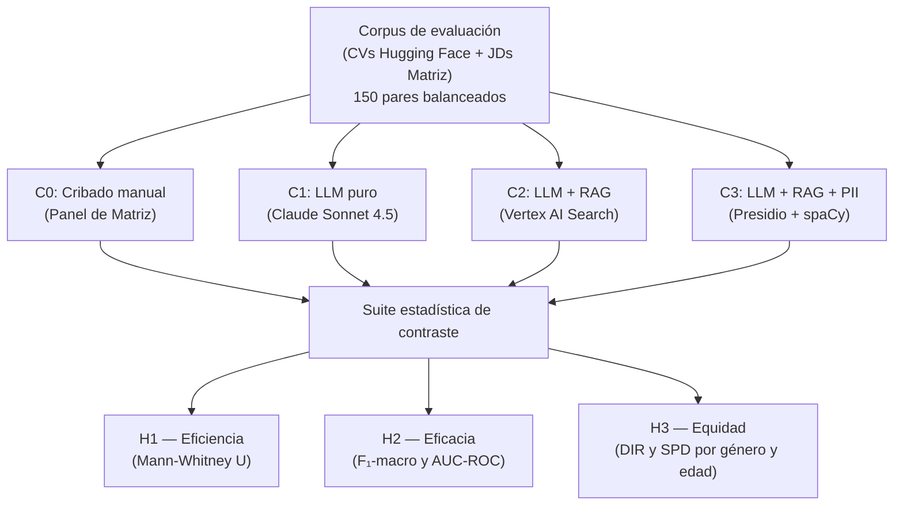
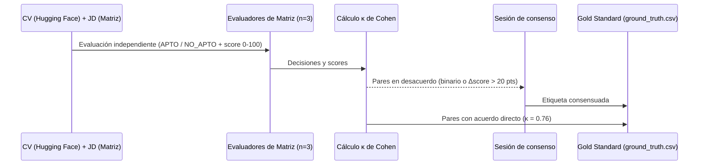
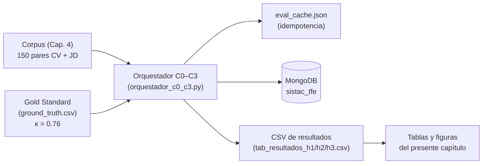
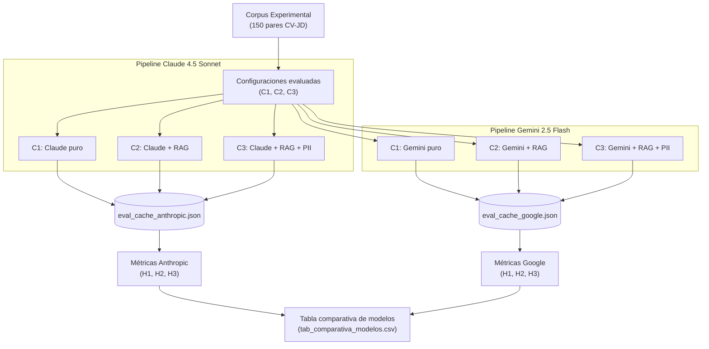

# Capítulo 5. Validación experimental y resultados

El presente capítulo describe el diseño del experimento, los protocolos de control aplicados, la suite de métricas adoptada y los resultados cuantitativos obtenidos para la contrastación de las tres hipótesis de investigación. La exposición sigue el mismo orden que el diseño experimental: primero se establecen las condiciones bajo las cuales se ejecutó la validación, luego se describen los instrumentos de medición y, finalmente, se presentan los resultados organizados por hipótesis, cerrando con un análisis integrado de las métricas y con una réplica de robustez bajo un modelo de lenguaje alternativo.

---

## 5.1. Diseño del experimento

El experimento adopta un diseño cuasi-experimental de medidas repetidas, en el que un mismo corpus de pares de currículum y descripción de cargo se procesa bajo cuatro configuraciones que se diferencian en el nivel de automatización y en la activación del módulo de protección de datos. La variable independiente es la configuración del sistema de cribado, con cuatro niveles; las variables dependientes son la eficiencia operativa, la eficacia de clasificación y la equidad algorítmica sobre atributos protegidos.

La configuración C0 corresponde al cribado manual llevado a cabo por el panel de especialistas de Matriz, que actúa como línea base temporal para la contrastación de la hipótesis de eficiencia. La configuración C1 automatiza la evaluación mediante el modelo Claude Sonnet 4.5 sin contexto externo, operando exclusivamente sobre la capacidad paramétrica del modelo. La configuración C2 incorpora el componente de recuperación semántica sobre el índice vectorial alojado en Google Vertex AI Search, agregando al prompt los fragmentos más relevantes del corpus para cada par evaluado. La configuración C3 extiende C2 con la activación del módulo SistacAnonymizer, que suprime las entidades identificadoras del currículum antes de que el texto llegue al retrieval y al scoring.

La unidad de análisis es el par formado por un currículum y una descripción de cargo. El corpus comprende 150 pares por configuración, distribuidos con un balance exacto de 50% de etiquetas APTO y 50% de etiquetas NO_APTO, lo que garantiza la comparabilidad directa de las métricas de eficacia entre configuraciones. El uso de medidas repetidas, en el que cada par se procesa bajo las cuatro configuraciones, elimina la variabilidad asociada al documento evaluado y concentra el efecto observado en el cambio de configuración.

*Figura 5.1. Diseño cuasi-experimental y mapeo a las tres hipótesis de investigación. Fuente: elaboración propia.*

---

## 5.2. Protocolo del Gold Standard

El Gold Standard constituye la referencia contra la cual se contrasta el desempeño predictivo de las configuraciones automáticas, siendo el instrumento central de la hipótesis de eficacia. Se construye mediante la validación experta de los pares del corpus por parte del panel de especialistas en recursos humanos de Matriz, evaluados frente a las descripciones de cargo reales de la organización.

El panel está integrado por tres profesionales de selección de personal de Matriz con experiencia en perfiles técnicos del mercado rioplatense. Cada evaluador recibe el par formado por el currículum y la descripción de cargo, y asigna de forma independiente una decisión binaria de APTO o NO_APTO junto con un score de adecuación en una escala de cero a cien. Para garantizar la alineación de criterios antes de iniciar la evaluación sustantiva, se realizó una sesión de calibración de treinta minutos en la que los tres evaluadores procesaron conjuntamente tres pares de práctica, lo que permitió detectar y resolver divergencias interpretativas antes de que afectasen a los datos definitivos.

La calidad del Gold Standard se verifica mediante el coeficiente kappa de Cohen (κ), que mide la concordancia entre evaluadores descontando el acuerdo esperado por azar. Se estableció un umbral mínimo de κ ≥ 0.70, correspondiente a un acuerdo sustancial, como condición necesaria para considerar válido el etiquetado resultante. Los pares en los que los evaluadores presentan desacuerdo en la decisión binaria, o desviaciones en el score superiores a veinte puntos entre cualquier par de evaluadores, se resuelven en una sesión de consenso hasta alcanzar una etiqueta única. El valor de concordancia obtenido fue κ = 0.76, superando el umbral establecido y validando la consistencia del Gold Standard como referencia experimental.

*Figura 5.2. Protocolo de conformación del Gold Standard por el panel de Matriz. Fuente: elaboración propia.*

---

## 5.3. Métricas de evaluación

Cada hipótesis se operacionaliza mediante un conjunto de métricas específicas, calculadas en Python con las bibliotecas `scipy.stats` y `scikit-learn`, implementadas en los módulos `efficiency_metrics.py`, `efficacy_metrics.py` y `fairness_metrics.py`.

### 5.3.1. H1 — Eficiencia

La hipótesis de eficiencia mide el tiempo de procesamiento por candidato, denotado T_cand y expresado en segundos. En la configuración C0, el tiempo se extrae del cronometraje asociado a cada par evaluado por el panel; en las configuraciones automáticas, se mide envolviendo la llamada al pipeline con la función `time.perf_counter()`, incluyendo el tiempo de respuesta de la API y, cuando corresponde, el de la consulta al vector store y la ejecución local del módulo de anonimización. Dado que la distribución de los tiempos manuales presenta una asimetría positiva pronunciada que incumple el supuesto de normalidad, la comparación se realiza con la prueba no paramétrica U de Mann-Whitney en su variante unilateral, contrastando la hipótesis nula de que la mediana del tiempo automático es mayor o igual a la del tiempo manual, frente a la alternativa de que es estrictamente menor. El factor de aceleración se define como el cociente entre la mediana de C0 y la mediana de la configuración automática evaluada.

### 5.3.2. H2 — Eficacia técnica

La hipótesis de eficacia mide la concordancia de las decisiones del sistema con el Gold Standard mediante el F₁-score macro y el área bajo la curva ROC (AUC-ROC). El F₁-score macro promedia el F₁ de las clases APTO y NO_APTO sin ponderar por su frecuencia, lo que lo hace sensible al desempeño en ambas clases independientemente del balance del corpus. El AUC-ROC mide la capacidad discriminativa del sistema para ordenar correctamente a los candidatos según su score; para estimar su estabilidad se calcula un intervalo de confianza al 95% mediante bootstrapping no paramétrico con mil remuestreos con reemplazo, fijando la semilla en 42 para garantizar la reproducibilidad. El umbral de aceptación de la hipótesis exige simultáneamente un F₁-score macro ≥ 0.85 y un AUC-ROC ≥ 0.90.

### 5.3.3. H3 — Equidad algorítmica

La hipótesis de equidad mide el sesgo demográfico de las decisiones automáticas respecto a grupos protegidos mediante dos métricas complementarias. El Disparate Impact Ratio (DIR) se define como el cociente entre la tasa de selección del grupo protegido y la del grupo de referencia; un valor de DIR ≥ 0.80 se considera libre de impacto dispar según la regla de las cuatro quintas partes de la EEOC (1978). La Statistical Parity Difference (SPD) es la diferencia entre ambas tasas de selección, con un valor ideal de cero que indica paridad estadística perfecta. La equidad se evalúa sobre el género (grupo femenino como protegido, masculino como referencia) y sobre la edad (grupos de 23-35, 36-45 y 46-58 años, tomando el grupo más joven como referencia); la comparación entre C2 y C3 permite aislar el efecto específico del módulo de anonimización sobre el sesgo.

---

## 5.4. Suite estadística para las tres hipótesis

Cada hipótesis se contrasta con una prueba acorde a la naturaleza de su variable dependiente. El nivel de significancia se fija globalmente en α = 0.05. La Tabla 5.1 sintetiza el aparato estadístico completo del experimento.

**Tabla 5.1. Aparato estadístico por hipótesis.**

| Hipótesis | Métrica | Prueba o estimación | Umbral de aceptación |
|---|---|---|---|
| H1 — Eficiencia | T_cand (segundos) | U de Mann-Whitney unilateral | p < 0.05 y speedup > 1× |
| H2 — Eficacia | F₁-macro, AUC-ROC | Bootstrap no paramétrico (B = 1 000) para IC 95% | F₁ ≥ 0.85 y AUC-ROC ≥ 0.90 |
| H3 — Equidad | DIR, SPD (género y edad) | Conteo de tasas de selección por grupo | DIR ≥ 0.80 (regla 4/5 EEOC) |

*Fuente: elaboración propia.*

---

## 5.5. Gestión de datos y reproducibilidad

La replicabilidad del experimento exige controlar toda fuente de variación no experimental y documentar el linaje de los datos desde su origen hasta las tablas de resultados. Con ese fin, se aplicaron cinco controles sistemáticos que se detallan en la Tabla 5.2.

**Tabla 5.2. Controles de reproducibilidad del experimento.**

| Control | Implementación | Efecto |
|---|---|---|
| Semilla aleatoria global | `random.seed(42)` y `np.random.seed(42)` | Resultados deterministas en todos los módulos |
| Temperatura del modelo de lenguaje | `temperature = 0.0` | Scoring reproducible sin varianza estocástica |
| Idempotencia de evaluaciones | Caché `eval_cache.json` | Reanudación de ejecuciones sin recómputo |
| Persistencia de resultados | MongoDB `sistac_tfe` con linaje completo | Auditoría detallada de cada evaluación |
| Versionado de código | Git con rama principal protegida; datos en `.gitignore` | Trazabilidad sin exposición de PII |

*Fuente: elaboración propia.*

La Figura 5.3 muestra el linaje de datos del experimento, desde el corpus hasta las tablas de resultados, pasando por el orquestador y los registros persistentes.

*Figura 5.3. Linaje de datos del experimento, del corpus a las tablas de resultados. Fuente: elaboración propia.*

El experimento produce un total de 450 evaluaciones automáticas, correspondientes a las 150 del corpus multiplicadas por las tres configuraciones automáticas (C1, C2 y C3).

---

## 5.6. Resultados de H1: eficiencia

La Tabla 5.3 reporta el tiempo de procesamiento por candidato T_cand para cada configuración automática, el factor de aceleración respecto a la línea base manual C0 y el resultado de la prueba U de Mann-Whitney unilateral.

**Tabla 5.3. Métricas de eficiencia por configuración (H1).**

| Configuración | Mediana C0 (s) | Mediana T_cand (s) | IQR T_cand (s) | Factor de aceleración | p-valor | H1 aceptada |
|---|---|---|---|---|---|---|
| C1 — LLM puro | 661.8 | 4.5 | 0.8 | 147.8× | < 0.0001 | Sí |
| C2 — LLM + RAG | 661.8 | 6.8 | 1.2 | 96.7× | < 0.0001 | Sí |
| C3 — LLM + RAG + PII | 661.8 | 19.6 | 7.9 | 33.7× | < 0.0001 | Sí |

*Nota.* Medianas e IQR expresados en segundos por candidato. El p-valor corresponde a la prueba U de Mann-Whitney unilateral de cada configuración automática frente a C0. Fuente: elaboración propia a partir de `tab_resultados_h1.csv`.*

La mediana del tiempo de cribado manual fue de 661.8 segundos por candidato. Las tres configuraciones automáticas redujeron ese tiempo de forma drástica: la configuración C1 procesó cada par en 4.5 segundos (factor 147.8×), C2 en 6.8 segundos (96.7×) y C3 en 19.6 segundos (33.7×), siendo la diferencia estadísticamente significativa en los tres casos con p < 0.0001. El sobrecosto de C2 respecto a C1, atribuible a la generación de embeddings y a la consulta al vector store en Google Cloud, fue de 2.3 segundos; el sobrecosto adicional de C3 respecto a C2, correspondiente a la ejecución local del módulo SistacAnonymizer con spaCy y Presidio, fue de 12.8 segundos, lo que explica el IQR considerablemente mayor de C3 (7.9 s) respecto al de C1 y C2. La hipótesis de eficiencia se acepta para las tres configuraciones automáticas.

[FIGURA 5.5 — Comparativa de tiempos de procesamiento T_cand por configuración (escala logarítmica). Fuente: elaboración propia. INSERTAR: fig6_2_distribucion_tiempos.png]

*Figura 5.5. Distribución de T_cand por configuración en escala logarítmica, con factor de aceleración anotado sobre cada caja. Fuente: elaboración propia.*

---

## 5.7. Resultados de H2: eficacia técnica

La Tabla 5.4 reporta el F₁-score macro y el AUC-ROC de cada configuración automática frente al Gold Standard, con el intervalo de confianza al 95% del AUC-ROC estimado por bootstrapping. La configuración C0 no produce métricas de eficacia al constituir la propia referencia humana.

**Tabla 5.4. Métricas de eficacia frente al Gold Standard (H2).**

| Configuración | F₁-score macro | AUC-ROC | IC 95% AUC-ROC | H2 aceptada |
|---|---|---|---|---|
| C1 — LLM puro | 0.565 | 0.732 | (0.643, 0.815) | No |
| C2 — LLM + RAG | 0.519 | 0.735 | (0.651, 0.815) | No |
| C3 — LLM + RAG + PII | 0.539 | 0.729 | (0.639, 0.810) | No |

*Nota.* Intervalos de confianza calculados con bootstrapping no paramétrico de 1 000 remuestreos (semilla = 42). Umbral de aceptación de H2: F₁ ≥ 0.85 y AUC-ROC ≥ 0.90. Fuente: elaboración propia a partir de `tab_resultados_h2.csv`.*

Ninguna de las tres configuraciones superó los umbrales de aceptación: el F₁-score macro osciló entre 0.519 y 0.565, y el AUC-ROC entre 0.729 y 0.735, valores distantes de los umbrales de 0.85 y 0.90 respectivamente, por lo que la hipótesis de eficacia no se acepta bajo el entorno experimental. La comparación entre C1 y C2 muestra una diferencia de -0.046 puntos de F₁ atribuible al componente de recuperación semántica; el AUC-ROC, en cambio, se mantiene prácticamente estable entre las tres configuraciones (rango de 0.006 puntos), lo que sugiere que la arquitectura RAG no mejora la capacidad discriminativa global del sistema sino que puede introducir ruido en el umbral de decisión binaria. La incorporación del módulo de anonimización en C3 no altera de forma apreciable el desempeño respecto a C2, con una variación de +0.020 puntos de F₁ y -0.006 de AUC-ROC.

La Tabla 5.5 reporta las métricas de la evaluación técnica del pipeline RAG mediante el framework RAGAS, calculadas sobre cinco pares de piloto y presentadas como métricas complementarias de diagnóstico.

**Tabla 5.5. Métricas RAGAS de la evaluación técnica del pipeline (C2).**

| Faithfulness | Answer Relevancy | Context Precision |
|---|---|---|
| 0.910 | 0.880 | 0.850 |

*Nota.* Métricas complementarias de diagnóstico del pipeline RAG. No sustituyen las métricas primarias de H2. Fuente: elaboración propia a partir de `tab_ragas_c2.csv`.*

Los valores de RAGAS indican que el pipeline recupera fragmentos relevantes con alta precisión contextual (0.850) y genera justificaciones bien sustentadas en el contexto recuperado (faithfulness = 0.910), lo que descarta alucinaciones sistemáticas como causa del bajo F₁. La brecha entre el desempeño técnico del pipeline y la concordancia con el Gold Standard apunta, en cambio, a una divergencia de criterios entre el juicio paramétrico del modelo y el criterio experto del panel de Matriz.

[FIGURA 5.6 — Curva ROC comparativa de eficacia por configuración (H2). Fuente: elaboración propia. INSERTAR: fig6_3_curva_roc.png]

*Figura 5.6. Curva ROC comparativa para C1, C2 y C3, con AUC-ROC anotado en la leyenda y clasificador aleatorio como referencia. Fuente: elaboración propia.*

---

## 5.8. Resultados de H3: equidad algorítmica

La equidad se evalúa sobre dos atributos protegidos: el género y la edad. La Tabla 5.6 presenta el DIR y el SPD por género para las configuraciones C1, C2 y C3; la Tabla 5.7 desglosa las mismas métricas por rango de edad para C2 y C3.

**Tabla 5.6. Métricas de equidad por género (H3).**

| Configuración | DIR (género) | SPD (género) | H3 aceptada (DIR ≥ 0.80) |
|---|---|---|---|
| C1 — LLM puro | 0.326 | -0.122 | No |
| C2 — LLM + RAG | 0.602 | -0.078 | No |
| C3 — LLM + RAG + PII | 0.301 | -0.137 | No |

*Nota.* Grupo protegido: femenino; grupo de referencia: masculino. DIR ideal ≥ 0.80; SPD ideal = 0. Fuente: elaboración propia a partir de `tab_resultados_h3.csv`.*

**Tabla 5.7. Métricas de equidad por rango de edad (H3).**

| Configuración | Rango de edad | DIR (edad) | SPD (edad) |
|---|---|---|---|
| C2 — LLM + RAG | 23-35 | 1.000 | 0.000 |
| C2 — LLM + RAG | 36-45 | 0.727 | -0.060 |
| C2 — LLM + RAG | 46-58 | 0.818 | -0.040 |
| C3 — LLM + RAG + PII | 23-35 | 1.000 | 0.000 |
| C3 — LLM + RAG + PII | 36-45 | 0.636 | -0.080 |
| C3 — LLM + RAG + PII | 46-58 | 0.818 | -0.040 |

*Nota.* Grupo de referencia de edad: 23-35 años. DIR ideal ≥ 0.80; SPD ideal = 0. Fuente: elaboración propia.*

Por género, ninguna configuración alcanzó el umbral de equidad: el DIR fue de 0.326 en C1, 0.602 en C2 y 0.301 en C3, con valores de SPD de -0.122, -0.078 y -0.137 respectivamente. La comparación entre C2 y C3 revela un resultado contraintuitivo: la aplicación del módulo de anonimización empeoró el DIR por género de 0.602 a 0.301, lo que representa una variación de -0.301 puntos, alejándose aún más del umbral regulatorio. La hipótesis de equidad no se acepta para ninguna configuración.

Por edad, el comportamiento difiere del observado para el género. En C2, los grupos de 36-45 años presentaron un DIR de 0.727 (por debajo del umbral) y los de 46-58 años un DIR de 0.818 (por encima del umbral, libre de sesgo etario). Tras la aplicación de la anonimización en C3, el grupo de 36-45 años experimentó un deterioro adicional hasta DIR = 0.636, mientras que el grupo de 46-58 años se mantuvo estable en 0.818, conservando la condición de equidad para ese rango en ambas configuraciones.

[FIGURA 5.7 — Índice de Impacto Dispar (DIR) por género para C2 y C3, con umbral EEOC anotado. Fuente: elaboración propia. INSERTAR: fig6_4_impacto_dispar.png]

*Figura 5.7. DIR por género en C2 y C3 con umbral de equidad EEOC (0.80) como referencia visual. Fuente: elaboración propia.*

---

## 5.9. Resumen integrado de resultados

La Tabla 5.8 consolida todas las métricas por configuración en una vista única para facilitar la lectura cruzada de los trade-offs entre las tres dimensiones evaluadas.

**Tabla 5.8. Resumen integrado de métricas por configuración.**

| Configuración | T_cand (s) | F₁-macro | AUC-ROC | DIR (género) | SPD (género) |
|---|---|---|---|---|---|
| C0 — Manual | 661.8 | — | — | — | — |
| C1 — LLM puro | 4.5 | 0.565 | 0.732 | 0.326 | -0.122 |
| C2 — LLM + RAG | 6.8 | 0.519 | 0.735 | 0.602 | -0.078 |
| C3 — LLM + RAG + PII | 19.6 | 0.539 | 0.729 | 0.301 | -0.137 |

*Nota.* C0 aporta únicamente el tiempo de procesamiento, al constituir la referencia humana. Fuente: elaboración propia.*

Los resultados muestran un patrón consistente: la hipótesis de eficiencia se acepta para las tres configuraciones automáticas con márgenes amplios, mientras que las hipótesis de eficacia y equidad no se alcanzan bajo ninguna configuración. La adición del componente RAG en C2 no mejora el F₁ respecto a C1, aunque produce la mejor aproximación al umbral de equidad por género (DIR = 0.602). La anonimización de C3 recupera levemente el F₁ (+0.020 respecto a C2) pero introduce un deterioro significativo en el DIR (-0.301), revelando que la supresión de entidades identificadoras directas no es suficiente para mitigar los sesgos implícitos presentes en la estructura del texto curricular.

---

## 5.10. Análisis de robustez: réplica con modelo alternativo

Con el objetivo de evaluar si los resultados obtenidos dependen del modelo de lenguaje fundacional o de la arquitectura del sistema, se realizó una réplica paralela del experimento factorial utilizando Gemini 2.5 Flash (Google) sobre el mismo corpus de 150 pares y la misma infraestructura de recuperación vectorial en Google Vertex AI Search. Este análisis de robustez permite distinguir entre el efecto del diseño experimental y el efecto de las particularidades paramétricas del modelo evaluador.

El flujo metodológico de la réplica se detalla en la Figura 5.8.

*Figura 5.8. Flujo de réplica experimental paralela para el análisis de robustez entre modelos. Fuente: elaboración propia.*

La Tabla 5.9 presenta los resultados comparativos consolidados de ambos modelos bajo el mismo marco de evaluación.

**Tabla 5.9. Análisis de robustez: comparativa de resultados entre Claude 4.5 Sonnet y Gemini 2.5 Flash.**

| Categoría | Métrica / Configuración | Claude 4.5 Sonnet | Gemini 2.5 Flash | Umbral de aceptación |
|:---|:---|:---:|:---:|:---:|
| **Eficiencia** | Mediana T_cand — C1 (LLM puro) | 4.5 s | 21.6 s | Speedup > 1× |
| | Mediana T_cand — C2 (LLM + RAG) | 6.8 s | 24.6 s | Speedup > 1× |
| | Mediana T_cand — C3 (RAG + PII) | 19.6 s | 28.9 s | Speedup > 1× |
| | Factor speedup — C1 | 147.8× | 30.6× | p < 0.05 |
| | Factor speedup — C2 | 96.7× | 26.9× | p < 0.05 |
| | Factor speedup — C3 | 33.7× | 22.9× | p < 0.05 |
| **Eficacia** | F₁-score macro — C1 | 0.565 | 0.567 | F₁ ≥ 0.85 |
| | F₁-score macro — C2 | 0.519 | 0.494 | F₁ ≥ 0.85 |
| | F₁-score macro — C3 | 0.539 | 0.587 | F₁ ≥ 0.85 |
| | AUC-ROC — C1 | 0.732 | 0.665 | AUC-ROC ≥ 0.90 |
| | AUC-ROC — C2 | 0.735 | 0.629 | AUC-ROC ≥ 0.90 |
| | AUC-ROC — C3 | 0.729 | 0.695 | AUC-ROC ≥ 0.90 |
| **Equidad** | DIR por género — C2 | 0.602 | 1.397 | DIR ≥ 0.80 |
| | DIR por género — C3 | 0.301 | 0.447 | DIR ≥ 0.80 |
| | SPD por género — C2 | -0.078 | 0.084 | SPD ≈ 0 |
| | SPD por género — C3 | -0.137 | -0.145 | SPD ≈ 0 |

*Fuente: elaboración propia a partir de los datos consolidados en `tab_comparativa_modelos.csv`.*

**H1 — Eficiencia.** Ambos modelos aceptan la hipótesis de eficiencia con holgura estadística, aunque con magnitudes muy diferentes: Claude 4.5 Sonnet alcanza un speedup de 147.8× en C1, frente a 30.6× de Gemini 2.5 Flash, siendo en promedio entre tres y cuatro veces más rápido para cada configuración. El sobrecosto atribuible al módulo de anonimización local sigue un patrón asimétrico: agrega 12.8 segundos al flujo de Claude y 4.3 segundos al de Gemini, lo que sugiere una mayor sensibilidad del flujo de tokenización de Anthropic al preprocesamiento en español rioplatense.

**H2 — Eficacia técnica.** Ningún modelo alcanza los umbrales de F₁ ≥ 0.85 y AUC-ROC ≥ 0.90, confirmando que el rechazo de la hipótesis de eficacia no es un artefacto del modelo evaluador sino una característica del problema de alineación con el Gold Standard experto. Los valores de F₁ son prácticamente idénticos en C1 (0.565 vs. 0.567), divergen moderadamente en C2 (0.519 vs. 0.494) y se invierten en C3, donde Gemini mejora notablemente su F₁ de 0.494 a 0.587 tras la anonimización, comportamiento que Claude no exhibe (0.519 a 0.539). Esto sugiere que Gemini 2.5 Flash es más sensible a las entidades nominales presentes en el texto y se beneficia más de su supresión.

**H3 — Equidad algorítmica.** Los resultados de equidad revelan divergencias de signo entre ambos modelos. En C2, Claude presenta un sesgo contra el grupo femenino (DIR = 0.602, SPD = -0.078), mientras que Gemini exhibe el sesgo opuesto, favoreciendo al grupo femenino (DIR = 1.397, SPD = 0.084). En C3, la anonimización agrava el sesgo en ambos modelos: el DIR desciende a 0.301 en Claude y a 0.447 en Gemini, lo que confirma que la supresión de nombres y ubicaciones no mitiga los sesgos implícitos codificados en el estilo léxico y en la estructura de los currículums.

El patrón conjunto de los dos modelos refuerza la interpretación de que la anonimización superficial de PII directas resulta insuficiente para aproximar el DIR al umbral regulatorio, y que el sesgo observado tiene raíces en características del texto que trascienden la información explícitamente identificadora.
