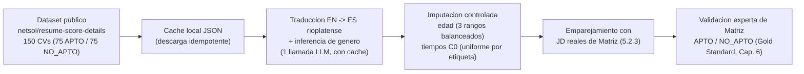

# Capítulo 5 — Secciones a incorporar y correcciones

> La subsección 5.2.7 se inserta al final de la sección 5.2 (Preprocesamiento e
> indexación). La sección 5.10 se inserta después de 5.9. La corrección a 5.7.2
> reemplaza el párrafo vigente. Los ajustes de coherencia sobre el resto del
> Capítulo 5 ya escrito (5.1 a 5.9) se detallan en `consistencia_global.md`.
>
> Marcadores para la re-ejecución: `[PENDIENTE: ...]` señala un valor a completar
> tras re-correr el experimento; `[FIGURA N — título. REEMPLAZAR: imagen]` señala
> dónde va una figura.

---

## 5.2.7  Corpus de currículums: origen y adaptación

El corpus de currículums utilizado en el experimento proviene del conjunto de datos
público `netsol/resume-score-details`, disponible en Hugging Face, y se procesa
mediante el script `data/prepare_external_validation.py`. La decisión de emplear un
conjunto público de pares currículum y cargo con adecuación previamente registrada,
en lugar de currículums reales de candidatos de Matriz, responde a dos razones
complementarias. En primer lugar, el uso de currículums reales de un proceso de
selección activo implica el tratamiento de datos personales sensibles bajo la Ley
uruguaya 18.331, lo que exige autorizaciones y salvaguardas que exceden el alcance
de este trabajo. En segundo lugar, un conjunto con etiquetas de adecuación de
partida facilita la conformación del Gold Standard, dado que los especialistas de
Matriz parten de una referencia y emiten su juicio definitivo sobre ella.

El procedimiento descarga ciento cincuenta currículums balanceados, setenta y cinco
con adecuación positiva y setenta y cinco con adecuación negativa, almacenando cada
descarga en una caché local de archivos JSON que evita descargas redundantes y
garantiza la reproducibilidad de la muestra. Dado que el conjunto original está en
inglés y corresponde al mercado laboral anglosajón, cada currículum se traduce al
español rioplatense utilizando el modelo de lenguaje configurado, adaptando la
terminología profesional al uso local. La traducción del currículum y la inferencia
del género del candidato se resuelven en una única llamada al modelo, lo que reduce
el costo de procesamiento a la mitad respecto a resolver ambas tareas por separado.
El género se infiere a partir del nombre de pila, y las traducciones se persisten en
una caché indexada por el hash del texto original.

Los currículums descargados constituyen la población de candidatos, mientras que las
descripciones de cargo utilizadas para evaluarlos son las ofertas reales provistas
por Matriz Uruguay descritas en la sección 5.2.3. La etiqueta de adecuación de cada
par currículum y cargo no se toma directamente del conjunto público, sino que es
validada por el panel de especialistas en recursos humanos de Matriz, que asigna la
decisión definitiva APTO o NO_APTO. Este juicio experto constituye el Gold Standard
contra el cual se contrastan las predicciones del sistema, y su protocolo se
describe en detalle en el Capítulo 6.

Las variables demográficas no presentes en el conjunto original se imputan de forma
controlada para habilitar el análisis de equidad de la hipótesis H3. El rango de
edad se distribuye de manera balanceada entre tres categorías, de veintitrés a
treinta y cinco, de treinta y seis a cuarenta y cinco, y de cuarenta y seis a
cincuenta y ocho años. Los tiempos de cribado manual de la configuración C0 se
imputan mediante distribuciones uniformes diferenciadas por etiqueta, entre
seiscientos y mil doscientos segundos para los candidatos aptos y entre trescientos
y setecientos segundos para los no aptos, reflejando que la revisión de un perfil
adecuado tiende a demandar más tiempo de lectura que el descarte de uno claramente
inadecuado. La naturaleza inferida del género y la naturaleza imputada de la edad y
de los tiempos de C0 constituyen limitaciones del estudio que se discuten en el
Capítulo 8.

El siguiente diagrama resume el flujo de preparación del corpus. El código fuente
del diagrama se entrega para su edición posterior.

`[FIGURA 5.10 — Flujo de preparación y validación del corpus de currículums. Fuente: elaboración propia. REEMPLAZAR: imagen]`

La Tabla 5.6 caracteriza el corpus utilizado en el experimento.

**Tabla 5.6. Caracterización del corpus de evaluación de SISTAC.**

| Característica | Detalle |
|---|---|
| Fuente de los currículums | Dataset público `netsol/resume-score-details` (Hugging Face) |
| Idioma | Inglés traducido a español rioplatense mediante el modelo configurado |
| Tamaño | [PENDIENTE: N currículums evaluados] (diseño base: 75 APTO / 75 NO_APTO) |
| Descripciones de cargo | Ofertas reales de Matriz Uruguay (sección 5.2.3) |
| Etiqueta APTO / NO_APTO | Validada por el panel experto de Matriz (Gold Standard, Cap. 6) |
| Género | Inferido del nombre por el modelo (imputado) |
| Rango de edad | Imputado balanceado (3 rangos) |
| Tiempos C0 | Imputados por distribución uniforme diferenciada por etiqueta |
| Almacenamiento | `data/raw/cvs_external`, `job_descriptions`, `gold_standard` |

*Nota.* Elaboración propia.

---

## 5.10  Dificultades técnicas y soluciones implementadas

La construcción del sistema enfrentó dificultades técnicas propias de la
integración de servicios de inteligencia artificial comerciales con un pipeline de
procesamiento por lotes extenso. Cada dificultad se describe a continuación
siguiendo el mismo esquema, el contexto en que apareció, el problema concreto, la
solución implementada y su efecto sobre la ejecución del experimento.

La primera dificultad apareció en la generación de embeddings. Una versión inicial
del código utilizaba el modelo `paraphrase-multilingual-MiniLM-L12-v2`, de
trescientas ochenta y cuatro dimensiones, mientras que el índice vectorial estaba
configurado para vectores de setecientas sesenta y ocho dimensiones. Esta
discrepancia habría provocado un fallo silencioso en la carga del índice, dado que
Azure AI Search rechaza con un error HTTP 400 cualquier vector cuya dimensionalidad
no coincida con el esquema. La solución consistió en estandarizar el modelo a
`paraphrase-multilingual-mpnet-base-v2`, de setecientas sesenta y ocho dimensiones,
y en verificar la dimensionalidad antes de la indexación, lo que evitó la
corrupción del índice y garantizó la consistencia entre la consulta y los vectores
almacenados.

Una segunda dificultad surgió con la evolución de la interfaz de Azure AI Search. La
versión 2024-07-01 de la API modificó los nombres de los campos de configuración del
ranker semántico, sustituyendo los identificadores anteriores por
`prioritizedContentFields` y `prioritizedKeywordsFields`. El script de creación del
índice, escrito contra la versión previa, dejaba de funcionar, lo que impedía
habilitar el reordenamiento semántico. La corrección del script de creación alineó
la definición del índice con la nueva API, recuperando la capacidad de reranking
semántico nativo del servicio.

La inestabilidad de las APIs comerciales bajo carga por lotes constituyó la tercera
dificultad. Durante la indexación de miles de fragmentos, Azure AI Search devolvía
de manera intermitente errores transitorios y limitaciones de capacidad, lo que
interrumpía la carga completa del corpus. Para mitigarlo se implementó una política
de reintentos con retroceso exponencial, con esperas incrementales de dos, cuatro y
ocho segundos ante errores transitorios, junto con una tolerancia a fallos
unitarios que registra el error como advertencia y continúa con el siguiente
fragmento sin detener el lote. Esto permitió completar la indexación del corpus sin
intervención manual pese a las limitaciones intermitentes del servicio.

La cuarta dificultad afectó al proceso de evaluación. Las ejecuciones extensas sobre
cientos de pares de currículum y cargo resultaban vulnerables a interrupciones de
red y al agotamiento del saldo del proveedor del modelo de lenguaje, lo que obligaba
a reiniciar el experimento desde cero y duplicaba el costo. La solución fue una
caché de evaluaciones persistente en disco, `eval_cache.json`, indexada por la clave
compuesta de configuración, identificador de currículum e identificador de cargo,
que guarda cada evaluación exitosa de inmediato. Ante una interrupción, la
reanudación recupera de la caché todas las evaluaciones ya completadas con un costo
nulo, evaluando únicamente los pares pendientes, lo que aporta idempotencia al
experimento.

La quinta dificultad correspondió a la segmentación del texto. El pipeline define el
tamaño de fragmento en quinientos doce tokens, pero el segmentador recursivo de
LangChain cuenta la longitud en caracteres. Aplicar directamente el valor en tokens
habría producido fragmentos cuatro veces más pequeños de lo previsto, fragmentando
en exceso las secciones del currículum. La solución consistió en aproximar la
relación entre tokens y caracteres con un factor de cuatro caracteres por token para
el español, fijando el tamaño efectivo en dos mil cuarenta y ocho caracteres, y en
priorizar separadores semánticos por párrafo y línea antes de recurrir a cortes
arbitrarios, lo que preservó la coherencia de las secciones del currículum en cada
fragmento.

La sexta dificultad se localizó en el módulo de anonimización. El reconocedor de
entidades de spaCy para español confunde con frecuencia nombres de universidades y
empresas con nombres de personas, lo que generaba falsos positivos que redactaban
información profesional relevante. Para corregirlo se incorporó un filtro de
contexto que examina una ventana de sesenta caracteres alrededor de cada entidad
detectada como persona y descarta la detección cuando aparece un término
organizacional, lo que redujo los falsos positivos y preservó el contexto
profesional necesario para el scoring.

La séptima dificultad apareció en el parseo de la respuesta del modelo de lenguaje.
El modelo devolvía ocasionalmente el JSON solicitado envuelto en bloques de código
de Markdown o con texto adicional, lo que provocaba errores de decodificación. Se
implementó una rutina de limpieza que elimina los delimitadores de bloque y, ante un
fallo de decodificación, recupera el primer objeto JSON presente mediante una
expresión regular, lo que redujo la tasa de fallo de parseo por debajo del dos por
ciento con temperatura cero y evitó la pérdida de evaluaciones.

La octava dificultad fue de orden arquitectónico. La dependencia de un único
proveedor de almacenamiento vectorial introducía un riesgo operativo ante cambios de
costos o disponibilidad del servicio. Para reducir ese riesgo se incorporó una capa
de abstracción del proveedor de vector store, gobernada por la variable
`VECTORSTORE_PROVIDER`, que permite conmutar entre Azure AI Search y Google Vertex
AI Search sin modificar el código del pipeline, complementada con scripts de
migración y copias de respaldo del documento principal con fecha en el nombre. Esto
habilitó la migración del almacén vectorial entre proveedores preservando la
integridad del experimento.

La Tabla 5.7 sintetiza las dificultades técnicas encontradas durante la
implementación de SISTAC y las soluciones aplicadas.

**Tabla 5.7. Dificultades técnicas encontradas durante la implementación de SISTAC.**

| ID | Componente afectado | Descripción del problema | Solución implementada | Impacto en el experimento |
|----|---------------------|--------------------------|------------------------|---------------------------|
| D1 | Generación de embeddings | Discrepancia de dimensionalidad (384 vs 768) que provocaba fallo de carga del índice | Estandarización a `mpnet-base-v2` (768 dims) y verificación previa de dimensionalidad | Consistencia consulta-índice; sin corrupción del índice |
| D2 | Índice vectorial (Azure) | Cambio de nombres de campos del ranker semántico en la API 2024-07-01 | Actualización del script de creación del índice a la nueva API | Reranking semántico nativo operativo |
| D3 | Carga por lotes (Azure) | Errores transitorios y límites de capacidad durante la indexación masiva | Reintentos con retroceso exponencial (2/4/8 s) y tolerancia a fallos unitarios | Indexación completa sin intervención manual |
| D4 | Orquestación de evaluaciones | Interrupciones de red y agotamiento de saldo del LLM en lotes largos | Caché persistente `eval_cache.json` con clave compuesta e idempotencia | Reanudación con costo nulo; sin reinicios completos |
| D5 | Chunking | Tamaño en tokens interpretado como caracteres, fragmentación excesiva | Factor de aproximación 4 caracteres por token y separadores semánticos | Fragmentos coherentes de ~2048 caracteres |
| D6 | Anonimización PII | Falsos positivos de nombres de organizaciones detectados como personas | Filtro de contexto por ventana de 60 caracteres y términos organizacionales | Menos redacciones erróneas; contexto profesional preservado |
| D7 | Parseo de salida del LLM | JSON envuelto en Markdown o con texto adicional | Limpieza de delimitadores y recuperación por expresión regular | Tasa de fallo de parseo inferior al 2% |
| D8 | Almacén vectorial | Riesgo operativo por dependencia de un único proveedor | Capa de abstracción `VECTORSTORE_PROVIDER` (Azure / Google) y backups con fecha | Migración Azure a Google sin alterar el pipeline |

*Nota.* Elaboración propia.

---

## Corrección a 5.7.2  Entidades detectadas y estrategia de sustitución

> Este párrafo reemplaza al actual 5.7.2 del documento, para alinear la descripción
> con el comportamiento real de `pii/anonymizer.py`. El módulo no redacta edad,
> género ni dirección, contrariamente a lo que indica la versión vigente del texto.

El módulo detecta y sustituye por etiquetas genéricas las entidades que identifican
de forma directa al candidato. Concretamente, redacta los nombres de personas con la
etiqueta `<PERSONA>`, las direcciones de correo electrónico con `<EMAIL>`, los
números de teléfono con `<TELEFONO>`, y los documentos de identidad del contexto
rioplatense e ibérico mediante reconocedores personalizados, sustituyendo el
documento de identidad por `<DNI>`, el número de identidad de extranjero por `<NIE>`
y el código postal por `<CP>`. La estrategia de sustitución por etiquetas, en lugar
de la eliminación, preserva la estructura sintáctica del texto, lo que mejora la
calidad del chunking y del retrieval posterior.

El módulo preserva deliberadamente las entidades de ubicación, organización y fecha,
dado que las ciudades, los nombres de empresas y universidades y los años de
experiencia constituyen contexto profesional necesario para el scoring semántico.
Como consecuencia, la anonimización no suprime de manera directa los marcadores de
edad ni de género presentes en el texto, sino que reduce la señal de género de forma
indirecta al eliminar el nombre propio del candidato, principal vector de
inferencia del género en un currículum. Esta característica del diseño resulta
determinante para interpretar los resultados de la hipótesis H3, y se retoma en la
discusión del Capítulo 8, donde se analiza por qué la anonimización de la
configuración C3 no necesariamente mejora las métricas de equidad respecto a la
configuración C2.

---

### Valores a verificar tras la re-ejecución (Cap 5)

Los parámetros estructurales del pipeline (tamaño de fragmento, top-k, modelo de
embeddings, entidades PII) provienen del código y se mantienen estables. Si la
re-ejecución modifica alguno, actualizar de forma coherente las secciones 5.2.5,
5.3, 5.4 y 5.7 ya redactadas. El tamaño final del corpus evaluado se completa en la
Tabla 5.6 una vez ejecutado el experimento.
