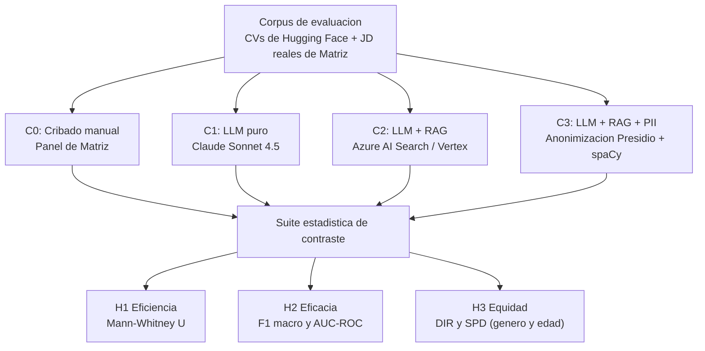
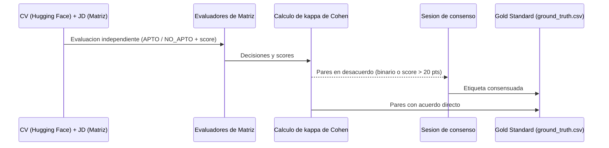

# Capítulo 6 — Validación experimental

> Reescritura del borrador `framework_validacion_experimental.md`, alineada con el
> marco canónico de `consistencia_global.md`. Voz impersonal, sin citas de terceros,
> prosa sin guiones largos. Marcadores `[PENDIENTE: ...]` para valores a completar
> tras la re-ejecución; `[FIGURA N — título. REEMPLAZAR: imagen]` para figuras.

El presente capítulo describe cómo se diseñó y ejecutó el experimento que evalúa el
sistema SISTAC, así como las métricas con las que se contrastan las tres hipótesis.
La descripción avanza desde el diseño general del experimento hacia la conformación
del Gold Standard, las métricas de cada hipótesis y el procedimiento de ejecución,
de modo que cualquier evaluador pueda reconstruir el experimento a partir de lo
documentado.

---

## 6.1  Diseño del experimento

El experimento adopta un diseño cuasi-experimental de medidas repetidas, en el que
un mismo corpus de pares currículum y cargo se evalúa bajo cuatro configuraciones
sucesivas que se diferencian en el nivel de automatización y de protección de datos.
La variable independiente es la configuración del proceso de cribado, con cuatro
niveles, y las variables dependientes son la eficiencia, la eficacia de
clasificación y la equidad algorítmica, una por cada hipótesis.

Las cuatro configuraciones constituyen los niveles del factor. La configuración C0
corresponde al cribado manual realizado por el panel de especialistas de Matriz, que
opera como línea base. La configuración C1 evalúa cada par mediante Claude Sonnet 4.5
sin contexto externo, utilizando únicamente la capacidad paramétrica del modelo. La
configuración C2 incorpora el componente de recuperación sobre el índice vectorial,
agregando al prompt los fragmentos más relevantes recuperados del corpus. La
configuración C3 antepone la anonimización de datos personales al pipeline de C2,
sustituyendo las entidades identificadoras antes del retrieval y del scoring. Esta
progresión permite aislar el efecto del componente RAG en la comparación de C1 con
C2, y el efecto de la anonimización en la comparación de C2 con C3.

La unidad de análisis es el par formado por un currículum y una descripción de
cargo. Cada currículum del corpus, descrito en la sección 5.2.7, se evalúa contra las
descripciones de cargo reales de Matriz presentadas en la sección 5.2.3. El uso de
medidas repetidas, en las que el mismo par se procesa bajo las cuatro
configuraciones, elimina la variabilidad asociada al currículum evaluado y aumenta la
potencia estadística de las comparaciones, dado que las diferencias observadas se
atribuyen al cambio de configuración y no a diferencias entre los documentos. El
corpus comprende [PENDIENTE: N pares currículum y cargo] evaluaciones por
configuración, con balance de etiquetas de cincuenta por ciento APTO y cincuenta por
ciento NO_APTO.

`[FIGURA 6.1 — Diseño cuasi-experimental de SISTAC y mapeo a las tres hipótesis. Fuente: elaboración propia. REEMPLAZAR: imagen]`

---

## 6.2  Protocolo del Gold Standard

El Gold Standard constituye la referencia contra la cual se contrasta el desempeño
predictivo de las configuraciones automáticas, y su validez condiciona la
interpretación de la hipótesis H2. En SISTAC, el Gold Standard se construye mediante
la validación experta de los currículums del corpus por parte del panel de
especialistas en recursos humanos de Matriz, evaluados contra las descripciones de
cargo reales de la organización.

El panel está integrado por [PENDIENTE: N evaluadores] profesionales de selección de
personal de Matriz con experiencia en perfiles técnicos del mercado rioplatense.
Cada evaluador recibe el par formado por el currículum traducido y la descripción de
cargo, y asigna de forma independiente una decisión cualitativa de APTO o NO_APTO
junto con un score de adecuación en una escala de cero a cien. La etiqueta de
adecuación de partida provista por el conjunto público se utiliza únicamente como
referencia inicial, mientras que la decisión definitiva surge del juicio experto,
lo que ancla el Gold Standard en criterios profesionales reales y no en la etiqueta
heredada del dataset.

La calidad del Gold Standard se verifica mediante el coeficiente kappa de Cohen, que
mide la concordancia entre evaluadores descontando el acuerdo esperado por azar. Se
establece un umbral mínimo de κ mayor o igual a 0.70, correspondiente a un acuerdo
sustancial, como condición para considerar válido el etiquetado. Los pares en los
que los evaluadores presentan desacuerdo en la decisión binaria, o desviaciones en
el score superiores a veinte puntos, se resuelven en una sesión de consenso hasta
alcanzar una etiqueta única. El valor de concordancia obtenido es κ = [PENDIENTE:
valor de κ de Cohen], lo que [PENDIENTE: confirmar si supera el umbral de 0.70 y
valida el Gold Standard].

`[FIGURA 6.2 — Protocolo de conformación del Gold Standard por el panel de Matriz. Fuente: elaboración propia. REEMPLAZAR: imagen]`

---

## 6.3  Métricas de evaluación

Cada hipótesis se operacionaliza mediante métricas específicas, calculadas en Python
con las bibliotecas `scipy.stats` y `scikit-learn`, esta última restringida al
cálculo de métricas de clasificación.

### 6.3.1  H1 — Eficiencia

La hipótesis H1 mide el tiempo de procesamiento por candidato, denotado T_cand y
expresado en segundos. En la configuración C0 el tiempo se registra a partir de los
tiempos de cribado manual asociados a cada par, mientras que en las configuraciones
automáticas C1, C2 y C3 el tiempo se mide envolviendo la llamada al pipeline con la
función `time.perf_counter()` de la biblioteca estándar de Python. Dado que la
distribución de los tiempos manuales presenta una asimetría positiva pronunciada que
incumple el supuesto de normalidad, la comparación se realiza con la prueba no
paramétrica U de Mann-Whitney en su variante unilateral, contrastando la hipótesis
nula de que la mediana del tiempo automático es mayor o igual a la del tiempo manual
frente a la alternativa de que es menor. El factor de aceleración se define como el
cociente entre la mediana del tiempo de C0 y la mediana del tiempo de la
configuración automática correspondiente.

### 6.3.2  H2 — Eficacia técnica

La hipótesis H2 mide la concordancia de las decisiones del sistema con el Gold
Standard mediante el F1-score macro y el área bajo la curva ROC, denotada AUC-ROC. El
F1-score macro promedia el F1 de las clases APTO y NO_APTO sin ponderar por su
frecuencia, lo que resulta apropiado en un corpus balanceado. El AUC-ROC mide la
capacidad del sistema de ordenar correctamente a los candidatos según su score,
con independencia del umbral de decisión, y se interpreta como la probabilidad de
que un candidato apto reciba un score superior al de uno no apto. Para estimar la
estabilidad del AUC-ROC se calcula un intervalo de confianza al noventa y cinco por
ciento mediante bootstrapping no paramétrico con mil remuestreos con reemplazo,
tomando los cuantiles 2.5 y 97.5 de la distribución empírica. El umbral de
aceptación de la hipótesis exige un F1-score macro mayor o igual a 0.85 y un AUC-ROC
mayor o igual a 0.90. La comparación entre C1 y C2 permite aislar el aporte del
componente RAG a la eficacia.

### 6.3.3  H3 — Equidad algorítmica

La hipótesis H3 mide la equidad de las decisiones automáticas respecto a grupos
demográficos protegidos mediante dos métricas complementarias. El Disparate Impact
Ratio, denotado DIR, es el cociente entre la tasa de selección del grupo protegido y
la del grupo de referencia, y se considera libre de impacto dispar cuando alcanza al
menos 0.80, según la regla de las cuatro quintas partes de la EEOC. El Statistical
Parity Difference, denotado SPD, es la diferencia entre ambas tasas de selección, con
un valor ideal de cero. La equidad se evalúa sobre dos atributos, el género, con el
grupo femenino como protegido y el masculino como referencia, y la edad, con los
rangos imputados descritos en la sección 5.2.7. La comparación entre C2 y C3 permite
medir el efecto de la anonimización sobre el sesgo. Dado que el módulo de
anonimización suprime el nombre del candidato pero preserva otras señales del texto,
según se detalla en la sección 5.7.2, la interpretación de la diferencia entre C2 y
C3 se desarrolla en el Capítulo 8.

---

## 6.4  Procedimiento de ejecución

El experimento se ejecuta mediante el orquestador `experiments/orquestador_c0_c3.py`,
que carga los pares currículum y cargo del Gold Standard, recupera los tiempos del
cribado manual de C0 y ejecuta de forma sucesiva las configuraciones C1, C2 y C3
sobre el mismo conjunto de pares. Para cada par, el orquestador invoca el pipeline
de la configuración correspondiente, obtiene el score, la decisión y la
justificación, y agrega la metadata del Gold Standard necesaria para el cálculo de
las métricas.

La reproducibilidad se garantiza fijando la semilla aleatoria global en
cuarenta y dos al inicio del script, tanto para el módulo `random` como para
`numpy`, y configurando el modelo de lenguaje con temperatura cero, lo que asegura
que evaluaciones repetidas del mismo par produzcan el mismo resultado. La caché de
evaluaciones persistente, descrita en la sección 5.10, aporta idempotencia al
procedimiento, de modo que una interrupción no obliga a recomputar las evaluaciones
ya realizadas. Una vez completadas las cuatro configuraciones, el orquestador invoca
los módulos de métricas de eficiencia, eficacia y equidad, y exporta los resultados
en formato CSV y en tablas Word a la carpeta `paper/tables/`, listas para insertarse
en el Capítulo 7. El experimento se ejecuta sobre [PENDIENTE: N pares currículum y
cargo] pares y produce [PENDIENTE: N evaluaciones] evaluaciones automáticas en total
entre las tres configuraciones.

---

### Valores a completar tras la re-ejecución (Cap 6)

`[PENDIENTE]` N evaluadores del panel de Matriz · valor de κ de Cohen y su veredicto
· N de pares currículum y cargo del corpus · N total de evaluaciones automáticas.
