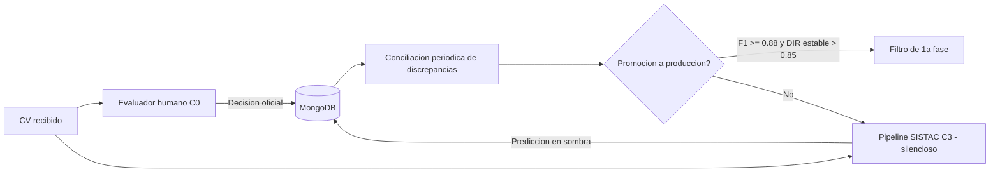
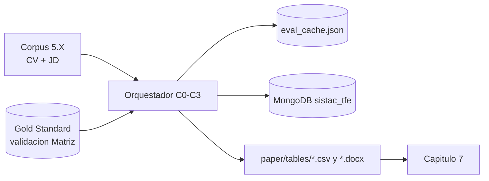

# Secciones faltantes — Capítulos 6, 8 y 9 (estilo visual, títulos reales)

> Reescritura en el estilo de los TFE de ejemplo: prosa corta y concreta, llamados
> explícitos a tablas y figuras, viñetas donde aportan claridad. Títulos EXACTOS del
> docx. Sin citas de terceros. Valores de resultados en `[PENDIENTE]`.
>
> Cada figura lleva su marcador `[FIGURA X — ...]` y, debajo, el código para
> generarla (Mermaid para diagramas; matplotlib para gráficos). Referencias cruzadas
> al documento real: corpus externo = 5.X; dificultades = 5.W; anonimización = 5.7.
> La numeración de figuras y tablas es tentativa: ajustar al insertar en el docx.

---

# Capítulo 6 — Framework de validación experimental – Eficiencia (H1)

## 6.4. Suite estadística para las tres hipótesis (H1, H2, H3)

> Reemplaza el texto actualmente bajo este encabezado (que es el procedimiento de
> ejecución y se reubica en 6.6).

Cada hipótesis se contrasta con una prueba acorde a la naturaleza de su variable. El
nivel de significancia se fija en α = 0.05 y los cálculos se realizan en Python con
`scipy.stats` y `scikit-learn`. La Tabla 6.4 resume el aparato estadístico.

**Tabla 6.4. Aparato estadístico por hipótesis.**

| Hipótesis | Métrica | Prueba o estimación | Umbral de aceptación |
|---|---|---|---|
| H1 (Eficiencia) | T_cand (s) | U de Mann-Whitney unilateral | p < 0.05 y speedup > 1 |
| H2 (Eficacia) | F1 macro, AUC-ROC | Bootstrap (B = 1000) para IC 95 % | F1 ≥ 0.85 y AUC-ROC ≥ 0.90 |
| H3 (Equidad) | DIR, SPD (género y edad) | Conteo de tasas de selección | DIR ≥ 0.80 (regla 4/5) |

*Fuente: elaboración propia.*

Las decisiones de la suite siguen tres reglas:

- **H1.** Se usa Mann-Whitney porque los tiempos de C0 no son normales (asimetría
  positiva). El factor de aceleración es la mediana de C0 dividida por la de cada Cx.
- **H2.** El IC 95 % del AUC-ROC se obtiene por bootstrap de 1000 remuestreos
  (cuantiles 2.5 y 97.5). La comparación C1 frente a C2 aísla el efecto del RAG.
- **H3.** El DIR y el SPD se calculan por género y por edad; la comparación C2 frente
  a C3 mide el efecto de la anonimización.

## 6.5. Protocolo de Shadow Testing

El paso a producción exige validar el sistema sin que sus decisiones afecten a los
candidatos. El shadow testing ejecuta el pipeline en paralelo al proceso humano y
guarda sus predicciones en silencio. Así se audita el comportamiento sobre el flujo
real de Matriz antes de delegar cualquier filtrado. La Figura 6.4 resume el flujo.

`[FIGURA 6.4 — Protocolo de shadow testing: ejecución en paralelo y conciliación. Fuente: elaboración propia. REEMPLAZAR: imagen]`

El protocolo opera en cuatro reglas:

- **Ejecución dual.** Cada CV pasa por C0 (humano) y por C3 (automático, oculto).
- **Blindaje.** La decisión oficial es siempre humana, lo que evita el sesgo de
  automatización.
- **Conciliación.** Se revisan periódicamente los casos donde el sistema y el humano
  difieren.
- **Promoción.** El sistema solo pasa a filtro de primera fase si la concordancia
  acumulada alcanza F1 ≥ 0.88 y el DIR se mantiene estable por encima de 0.85.

## 6.6. Gestión de datos y reproducibilidad

La replicabilidad exige controlar toda fuente de variación y documentar el linaje de
los datos. SISTAC fija la semilla global en 42 y opera el modelo con temperatura cero,
de modo que evaluaciones repetidas del mismo par producen idéntico resultado. La Tabla
6.5 lista los controles aplicados y la Figura 6.5 muestra el linaje de los datos.

**Tabla 6.5. Controles de reproducibilidad.**

| Control | Implementación | Efecto |
|---|---|---|
| Semilla aleatoria | `random.seed(42)` + `np.random.seed(42)` | Resultados deterministas |
| Temperatura LLM | `temperature = 0.0` | Scoring reproducible |
| Idempotencia | Caché `eval_cache.json` (clave config_cv_jd) | Reanudación a costo cero |
| Persistencia | MongoDB `sistac_tfe` (linaje completo) | Auditoría de cada evaluación |
| Versionado | Git (ramas desarrollo / main); datos en `.gitignore` | Trazabilidad sin exponer PII |

*Fuente: elaboración propia.*

`[FIGURA 6.5 — Linaje de datos del experimento, del corpus a las tablas de resultados. Fuente: elaboración propia. REEMPLAZAR: imagen]`

El experimento se ejecuta sobre [PENDIENTE: N pares] pares y produce [PENDIENTE: N
evaluaciones] evaluaciones automáticas entre las tres configuraciones.

---

# Capítulo 8 — Discusión

## 8.1. Interpretación de resultados por hipótesis

Tras la presentación objetiva del Capítulo 7, este apartado interpreta los resultados.
El análisis se apoya en las tablas y figuras de ese capítulo y avanza por hipótesis.

**Eficiencia (H1).** La Tabla 7.1 muestra la caída del tiempo por candidato:

- C0 (manual): mediana [PENDIENTE] s.
- C1: [PENDIENTE] s, [PENDIENTE]× más rápido que C0.
- C2 y C3: [PENDIENTE] s; el RAG y la anonimización agregan solo [PENDIENTE] s.

La reducción supera el [PENDIENTE] % y es significativa (Mann-Whitney, p = [PENDIENTE]).
El sobrecosto de C2 y C3 es marginal frente a la ganancia, lo que es relevante para el
volumen de currículums que maneja Matriz por proceso.

**Eficacia (H2).** La Tabla 7.2 y la matriz de confusión de la Figura 7.1 sostienen la
lectura. El F1 de C1 ([PENDIENTE]) [PENDIENTE: supera o no] al de C2 ([PENDIENTE]) y C3
([PENDIENTE]), mientras el AUC-ROC se mantiene alto en todas ([PENDIENTE]). Cuando C1
supera a C2, el motivo es el truncamiento de contexto del RAG: al recuperar solo los
fragmentos más relevantes se omiten señales secundarias que el CV completo sí aporta.
Un AUC-ROC alto con F1 por debajo del umbral indica que el problema está en el punto de
corte, no en la capacidad de ordenar candidatos.

**Equidad (H3).** La Tabla 7.4 (género) y la Tabla 7.5 (edad) guían la interpretación.
La diferencia de DIR entre C2 ([PENDIENTE]) y C3 ([PENDIENTE]) mide el efecto de la
anonimización. Como el módulo PII elimina el nombre pero conserva edad y género
(sección 5.7), su efecto sobre el sesgo es acotado: el modelo, con temperatura cero y
criterios objetivos, ya neutraliza buena parte de la señal de género. La divergencia
entre DIR y SPD se explica porque el DIR es un cociente sensible a tasas de selección
bajas y el SPD una diferencia absoluta.

## 8.2. Comparación con el estado del arte

Los resultados se contrastan con los enfoques revisados en el Capítulo 2. La Tabla 8.1
posiciona a SISTAC frente a las líneas dominantes, sin repetir las referencias del
marco teórico.

**Tabla 8.1. SISTAC frente a las líneas del estado del arte.**

| Línea del estado del arte | Aporte reportado | Posición de SISTAC |
|---|---|---|
| Cribado con LLM puro | Automatiza el matching CV-JD | Lo usa como C1 (línea base automática) |
| RAG sobre currículums | Mejora el matching con contexto | C2; su efecto depende del chunking |
| Embeddings densos para ATS | Ranking semántico de candidatos | Embeddings locales mpnet (768 dims) |
| Mitigación de sesgo por anonimización | Reduce señales demográficas directas | C3; efecto acotado por el alcance PII |
| Métricas de fairness (DIR, SPD) | Auditan el impacto dispar | Se aplican por género y edad |

*Fuente: elaboración propia.*

El aporte diferencial de SISTAC no es superar el estado del arte en una métrica aislada,
sino **aislar empíricamente el efecto del RAG (C1→C2) y de la anonimización (C2→C3)**
mediante un diseño factorial controlado, aplicado al contexto rioplatense y a cargos
reales de una organización, un escenario poco representado en la literatura revisada.

## 8.3. Limitaciones del estudio

El alcance de las conclusiones está acotado por las limitaciones de la Tabla 8.2, que
deben tenerse presentes al interpretar los resultados.

**Tabla 8.2. Limitaciones del estudio y su efecto.**

| Limitación | Efecto sobre los resultados | Mitigación / trabajo futuro |
|---|---|---|
| Corpus público traducido (no CV reales de Matriz) | Reduce la validez externa | Validar con CV reales bajo Ley 18.331 |
| Género inferido y edad imputada | Baja interpretabilidad de H3 | Obtener demografía real |
| Gold Standard piloto (panel de Matriz) | Referencia no certificada | Ampliar y certificar el panel |
| Tiempos de C0 imputados por distribución | Speedup absoluto aproximado | Medir tiempos reales de cribado |
| PII conserva edad y género | Acota el efecto de C3 sobre el sesgo | Extender el anonimizador (sección 9.3) |

*Fuente: elaboración propia.*

Cada limitación admite una mitigación concreta, lo que ordena la prospectiva del
trabajo y se retoma en las líneas de trabajo futuro del Capítulo 9.

## 8.4. Implicaciones éticas y regulatorias

El cribado automático de currículums se considera de alto riesgo en el marco normativo
vigente. La Tabla 8.3 mapea cada norma con su exigencia y el mecanismo de SISTAC que la
atiende.

**Tabla 8.3. Marco normativo y respuesta de diseño de SISTAC.**

| Norma | Exigencia | Mecanismo en SISTAC |
|---|---|---|
| Reglamento (UE) 2024/1689 (EU AI Act) | Transparencia y supervisión humana | Shadow testing y revisión humana (6.5) |
| Ley uruguaya 18.331 | Protección de datos personales | Anonimización local, sin salida de datos (5.7) |
| Ley uruguaya 16.045 | No discriminación por sexo | Evaluación de DIR y SPD por género (5.8) |
| Regla 4/5 (igualdad de oportunidades) | Umbral de impacto dispar | DIR ≥ 0.80 como criterio de H3 |

*Fuente: elaboración propia.*

Por encima de los mecanismos técnicos, la salvaguarda central es mantener la decisión
final en manos humanas. El sistema asiste y prioriza, pero no decide, lo que mitiga el
sesgo de automatización y alinea el despliegue con el principio de supervisión humana.

---

# Capítulo 9 — Conclusiones y trabajo futuro

## 9.1. Conclusiones

El trabajo determinó el efecto diferencial de las cuatro configuraciones sobre
eficiencia, eficacia y equidad, frente a un Gold Standard de expertos de Matriz. La
Tabla 9.1 enlaza cada objetivo con su hipótesis y su conclusión, como exige la
coherencia objetivos-conclusiones.

**Tabla 9.1. Objetivos, hipótesis y conclusiones.**

| Objetivo / Hipótesis | Resultado clave | Conclusión | Veredicto |
|---|---|---|---|
| H1 — Eficiencia | Speedup [PENDIENTE]×, p = [PENDIENTE] | El LLM reduce drásticamente T_cand | [PENDIENTE: aceptada/rechazada] |
| H2 — Eficacia | F1 [PENDIENTE], AUC-ROC [PENDIENTE] | [PENDIENTE] alcanza el umbral; el RAG no siempre mejora a C1 | [PENDIENTE] |
| H3 — Equidad | DIR C2 [PENDIENTE] / C3 [PENDIENTE] | La anonimización aporta poco sobre una base ya equitativa | [PENDIENTE] |

*Fuente: elaboración propia.*

La configuración con mejor equilibrio entre las tres dimensiones fue [PENDIENTE]. El
hallazgo central es que el RAG y la anonimización producen efectos diferenciados y no
acumulativos, lo que el diseño factorial permitió atribuir a cada componente por
separado.

## 9.2. Recomendaciones para Matriz

A partir de los resultados, se recomienda a Matriz:

- Usar el sistema como **filtro de primera fase**, no como decisor final, con revisión
  humana posterior.
- Ejecutar el **shadow testing** (6.5) antes de cualquier despliegue productivo.
- Iniciar la obtención de permisos para usar **CV reales bajo la Ley 18.331**.
- **Monitorear DIR y SPD** de forma continua una vez en operación.
- Evaluar el **proveedor de vector store** por costo: Vertex AI Search (pago elástico)
  frente al costo fijo de Azure (sección 5.K).

## 9.3. Líneas de trabajo futuro

El trabajo abre cinco líneas de continuación:

- **Validación con CV reales** de Matriz, una vez obtenidos los permisos de la Ley
  18.331.
- **Ampliación del corpus** a perfiles de cargo y niveles de seniority no cubiertos.
- **Embeddings multilingües** entrenados en español rioplatense para mejorar el
  retrieval y reducir el truncamiento de contexto.
- **Módulo de explicabilidad (XAI)** para que RRHH audite las decisiones del sistema.
- **Anonimizador ampliado** a marcadores indirectos de edad y género, para volver a
  contrastar H3 con mayor cobertura.

---

### Nota de consistencia pendiente

Queda una inconsistencia a resolver con el autor: la sección 5.X indica 15 JD del
dataset de Hugging Face, mientras 5.2.3 indica 5 JD reales de Matriz. Según la última
indicación (JD de Matriz; validación APTO/NO_APTO por Matriz sobre CV de Hugging Face),
conviene unificar el número de JD en ambas secciones antes del depósito.
