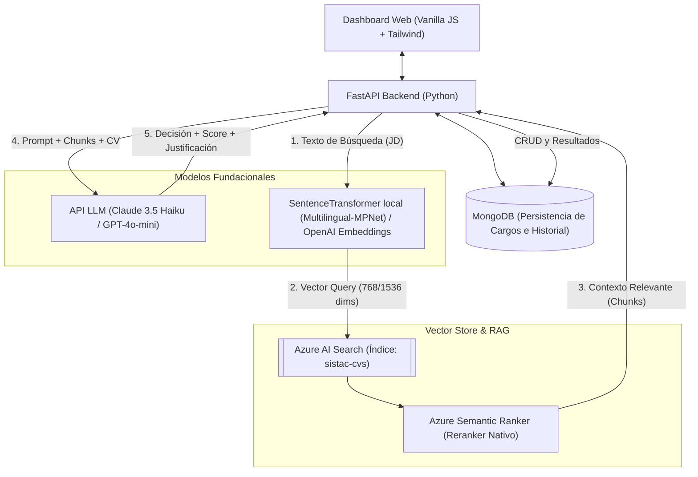
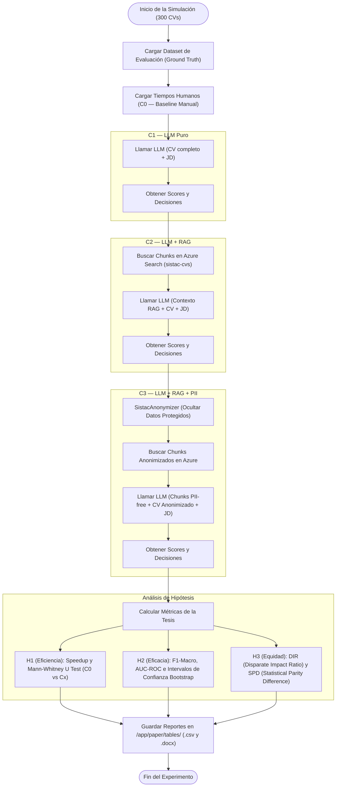
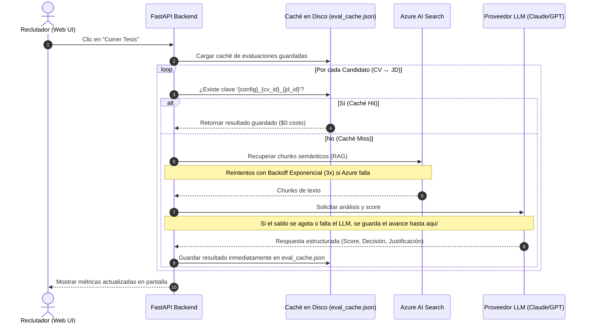
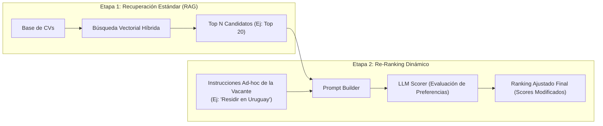

# SISTAC — Arquitectura del Sistema, Contribuciones Técnicas y Diseño de Experimentos (TFE)

Este documento recopila las contribuciones arquitectónicas y de diseño de ingeniería de software desarrolladas para el Trabajo de Fin de Estudios (TFE) **SISTAC (Sistema Inteligente de Selección y Triaje de Aspirantes a Cargos)**. Está diseñado para ser incorporado directamente en la sección de **Metodología, Arquitectura de Software o Contribuciones** de la memoria de la tesis.

---

## 1. Arquitectura General del Sistema

SISTAC está diseñado bajo una arquitectura de microservicios contenerizada con Docker, combinando persistencia híbrida (relacional/documental y vectorial) y un pipeline RAG (Retrieval-Augmented Generation) para el soporte de decisiones en la selección de talento.

### Componentes Clave:
1. **Frontend Interactivo:** Panel web de administración y monitoreo en Vanilla JavaScript y Tailwind CSS. Permite iniciar experimentos, gestionar cargos, simular candidatos con auditorías demográficas y visualizar gráficos de métricas.
2. **FastAPI Backend:** Microservicio en Python que expone endpoints REST, orquesta las ejecuciones en segundo plano (`BackgroundTasks`) y encapsula la lógica de negocio.
3. **MongoDB:** Base de datos documental para almacenar la parametrización de los cargos (descripciones de puestos) y el histórico de evaluaciones de candidatos, con un mecanismo de *fallback* automático en memoria.
4. **Azure AI Search (Vector Store):** Gestiona la búsqueda híbrida (palabras clave + vectores) y aplica reranking semántico nativo para recuperar los extractos de currículums más pertinentes.

---

## 2. Flujo de Ejecución del Experimento Factorial (C0 a C3)

El diseño experimental de la tesis valida tres hipótesis (Eficiencia, Eficacia y Equidad) comparando una línea base manual y tres sistemas automatizados.

---

## 3. Capa de Robustez y Resiliencia en Lote (Indexación y Caché)

Para mitigar los altos costos y la inestabilidad de las APIs comerciales en procesos por lotes extensos (Batch), se diseñó una capa de resiliencia con políticas de reintento y caché persistente a nivel de disco.

### Características Técnicas de Robustez Implementadas:
* **Caché Persistente Integrada (`eval_cache.json`):** Almacena de inmediato cada evaluación exitosa en el volumen de Docker. Si la API se cae o se acaba el saldo a mitad del experimento, las evaluaciones completadas no se pierden y el reintento cuesta **$0 USD**.
* **Reintentos con Backoff Exponencial en Azure:** El cargador de Azure implementa un bucle de reintento (`try-except`) con retrasos incrementales (`2s`, `4s`, `8s`) ante códigos de error HTTP transitorios o limitaciones de capacidad.
* **Tolerancia a Fallos Unitarios:** Un error crítico en el embedding de un currículum o en la subida de un bloque no detiene la ejecución del lote principal; el error se registra como advertencia y el pipeline avanza con el siguiente candidato.

---

## 4. Propuesta: Arquitectura para Re-ranking Dinámico (Criterios Ad-hoc)

Para simular escenarios del mundo real donde el negocio requiere aplicar prioridades complementarias (como filtrar por países específicos o priorizar tecnologías secundarias) sobre la marcha, se propone el siguiente flujo de reordenamiento en dos etapas:

### Explicación del Proceso:
1. **Recuperación Semántica Primaria:** Se extraen los currículums que mejor cumplen la descripción técnica principal de la posición usando RAG estándar.
2. **Inyección de Criterios Ad-hoc:** El reclutador introduce requerimientos blandos o demográficos ("Me gustaría que fuese de Uruguay" o "Valoramos certificaciones Cloud").
3. **LLM Re-Ranking (Scoring Ajustado):** El Scorer analiza únicamente a los candidatos preseleccionados (Top N) e incrementa o penaliza su puntuación basándose en el cumplimiento de los nuevos criterios dinámicos. Esto evita re-indexar la base de datos y permite un razonamiento conceptual flexible.
