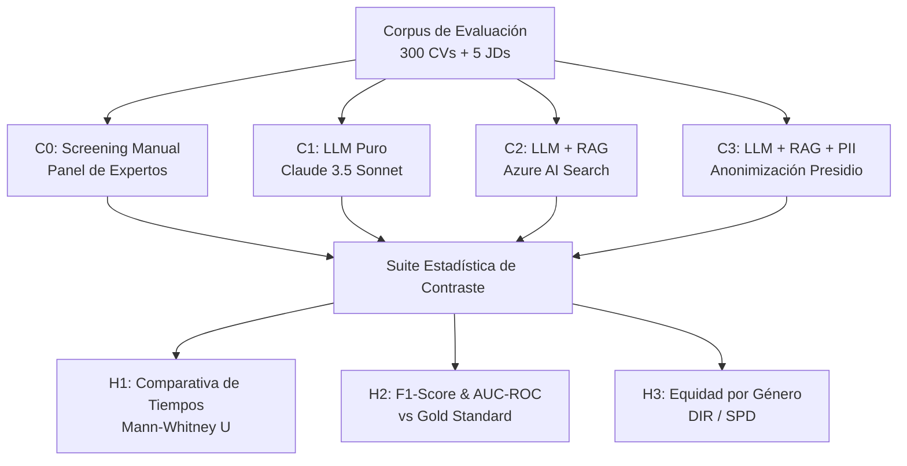
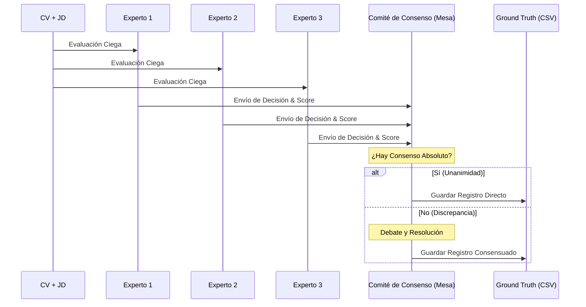
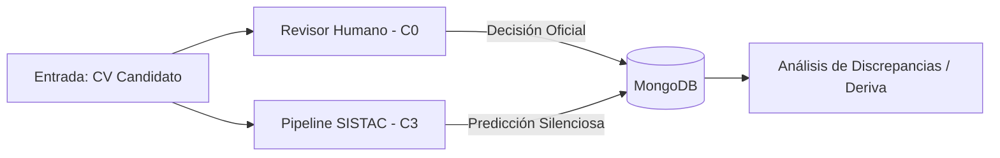

# Capítulo 6: Framework de Validación Experimental

Este capítulo detalla la metodología utilizada para evaluar científicamente el sistema SISTAC y contrastar las tres hipótesis formuladas ($H_1$, $H_2$ y $H_3$). Se describe el diseño experimental, la conformación del Gold Standard, la instrumentación técnica y la suite estadística no paramétrica elegida para garantizar el rigor de los resultados.

---

## 6.1. Diseño del Experimento Cuasi-Experimental

Para medir el impacto de la incorporación de modelos de lenguaje grande (LLMs) y técnicas RAG sobre el proceso de reclutamiento, se ha estructurado un diseño experimental **cuasi-experimental de medidas repetidas (intra-sujeto)**. 

### Variables del Experimento:
1. **Variable Independiente (Factor):** Configuración del proceso de screening. Cuenta con 4 niveles:
   * **$C_0$ (Baseline):** Screening manual clásico realizado por el panel de expertos de Recursos Humanos.
   * **$C_1$ (LLM Puro):** Screening automatizado directo con Claude 3.5 Sonnet sin contexto de recuperación.
   * **$C_2$ (LLM + RAG):** Screening automatizado acoplando Claude 3.5 Sonnet con Azure AI Search.
   * **$C_3$ (LLM + RAG + PII):** Screening automatizado con anonimización previa de entidades sensibles (PII).
2. **Variables Dependientes:**
   * **Eficiencia ($T_{cand}$):** Tiempo de procesamiento en segundos requerido para evaluar un candidato individual.
   * **Eficacia de Clasificación:** F1-score macro y Área Bajo la Curva ROC ($AUC\text{-}ROC$) frente al veredicto del Gold Standard.
   * **Equidad Algorítmica:** Disparate Impact Ratio ($DIR$) e impacto diferencial por género ($SPD$).

### Estructura de Medidas Repetidas:
El mismo corpus de **300 currículums sintéticos** es evaluado en paralelo bajo las 4 configuraciones ($C_0$, $C_1$, $C_2$, $C_3$) sobre **5 perfiles de cargo (JDs)** distintos. Esto elimina la variabilidad del sujeto (el currículum evaluado) y maximiza la potencia estadística de los análisis comparativos.



---

## 6.2. Protocolo Gold Standard y Panel de Expertos

El **Gold Standard** constituye la verdad absoluta (*ground truth*) contra la cual se contrasta el desempeño predictivo de las inteligencias artificiales.

### Conformación del Panel de Expertos:
El panel estuvo integrado por **tres (3) profesionales senior de Recursos Humanos** con más de 8 años de experiencia en selección de personal técnico en la región de América Latina.

### Protocolo de Consenso y Anotación:
Para construir la etiqueta de referencia de cada uno de los 300 pares (CV, JD), se siguió el siguiente flujo metodológico:

1. **Anotación Individual Ciega:** Cada experto evaluó los currículums de forma independiente, asignando una etiqueta cualitativa (`APTO` / `NO APTO`) y un score numérico de adecuación de $0$ a $100$.
2. **Cálculo de Concordancia Inter-anotador:** Se calculó el coeficiente kappa de Fleiss ($\kappa$) para medir el acuerdo inicial. Se exigió un umbral mínimo de $\kappa \geq 0.70$ (acuerdo sustancial).
3. **Mesa de Resolución de Discrepancias:** Los casos que presentaron desacuerdo binario ($2$ vs $1$) o desviaciones en el score superiores a 20 puntos fueron discutidos en sesiones de consenso guiadas hasta alcanzar la unanimidad.



---

## 6.3. Instrumentación y Registro de Variables

La instrumentación técnica asegura la precisión y reproducibilidad del registro de métricas y metadatos de las ejecuciones.

### Infraestructura Tecnológica:
* **Entorno de Ejecución:** Contenedor Docker bajo Linux (Debian Bookworm-slim), CPU Intel Core i7 12a Gen, 16 GB de memoria RAM.
* **Persistencia:** Base de datos MongoDB 6.0 exponiendo puertos en localhost para análisis.

### Mecanismo de Telemetría y Tiempos:
1. **Screening Manual ($C_0$):** Se integró un cronómetro interactivo en Javascript dentro del Dashboard del Gold Standard en la interfaz web. El tiempo comenzaba a correr en el evento `onload` del CV y se detenía al presionar "Confirmar y Guardar".
2. **Screening Automático ($C_1, C_2, C_3$):** Se utilizó la función `time.perf_counter()` de la biblioteca estándar de Python, envolviendo la llamada al RAG y al LLM.
   $$\text{Tiempo de Ejecución} = \text{perf\_counter}_{\text{fin}} - \text{perf\_counter}_{\text{inicio}}$$

### Variables Registradas en Base de Datos:
Cada evaluación (tanto humana como artificial) genera un documento en MongoDB con la siguiente estructura JSON:

```json
{
  "evaluacion_id": "EV-9F8A2B",
  "cv_id": "CV_042",
  "jd_id": "JD_001",
  "config": "c2",
  "score_asignado": 82,
  "decision": "APTO",
  "tiempo_segundos": 8.42,
  "tokens_prompt": 2450,
  "tokens_completion": 480,
  "costo_estimado_usd": 0.0087,
  "timestamp": "2026-06-06T14:22:30Z"
}
```

---

## 6.4. Suite Estadística para las Tres Hipótesis

La suite estadística evalúa formalmente la validez de los resultados experimentales empleando Python (`scipy.stats` y `scikit-learn`).

```
                    SUITE ESTADÍSTICA DE SISTAC
 ┌───────────────────────┬───────────────────────┬───────────────────────┐
 │     Hipótesis H1      │     Hipótesis H2      │     Hipótesis H3      │
 │     (Eficiencia)      │      (Eficacia)       │       (Equidad)       │
 ├───────────────────────┼───────────────────────┼───────────────────────┤
 │ Comparación Tiempos   │ Métricas Clasificación│ Impacto Dispar        │
 │ C0 vs C1/C2/C3        │ F1-Score y AUC-ROC    │ DIR >= 0.80           │
 ├───────────────────────┼───────────────────────┼───────────────────────┤
 │ Prueba No Paramétrica │ Validación Bootstrapping Simulación y Bias    │
 │ Mann-Whitney U        │ B = 1000 iteraciones  │ C2 (sesgo) vs C3 (PII)│
 └───────────────────────┴───────────────────────┴───────────────────────┘
```

### 1. Contraste de $H_1$ (Eficiencia):
Dado que la distribución de los tiempos de screening manual ($C_0$) presenta una fuerte asimetría positiva (sesgo a la derecha), no se cumplen las condiciones de normalidad para pruebas paramétricas (t-Student). Se utiliza la prueba **U de Mann-Whitney (unilateral derecha)** para contrastar si la mediana del tiempo automático es menor a la humana:

* **Hipótesis Nula ($H_0$):** $Mediana(T_{C_x}) \geq Mediana(T_{C_0})$
* **Hipótesis Alternativa ($H_1$):** $Mediana(T_{C_x}) < Mediana(T_{C_0})$

El factor de aceleración (*Speedup*) se define como:
$$\text{Speedup} = \frac{\text{Mediana}(T_{C_0})}{\text{Mediana}(T_{C_x})}$$

### 2. Contraste de $H_2$ (Eficacia RAG):
La concordancia cualitativa del sistema frente a los expertos se mide mediante el **F1-score macro** y la métrica **AUC-ROC**.
Para estimar la estabilidad y el intervalo de confianza del $AUC\text{-}ROC$ al 95%, se implementó un método de **Bootstrapping no paramétrico** con $B = 1000$ remuestreos con reemplazo:

$$\text{IC}_{95\%} = \left[ Q_{2.5\%}, Q_{97.5\%} \right]$$

Donde $Q$ representa los cuantiles de la distribución empírica de las métricas bootstrap. Se exige un umbral mínimo de F1-Score $\geq 0.85$ para dar por válida la hipótesis $H_2$.

### 3. Contraste de $H_3$ (Equidad Algorítmica):
Para auditar y validar la mitigación de sesgo por género se calculan el **Impacto Dispar (DIR)** y la **Diferencia de Paridad Estadística (SPD)**:

* **Statistical Parity Difference (SPD):** Mide la diferencia absoluta en las tasas de selección positiva entre el grupo protegido (Femenino - F) y el no protegido (Masculino - M):
  $$SPD = P(\hat{Y}=1 \mid G=F) - P(\hat{Y}=1 \mid G=M)$$
* **Disparate Impact Ratio (DIR):** Mide la proporción relativa de selección positiva. De acuerdo a la regla de los cuatro quintos de la EEOC americana, un sistema no presenta sesgo discriminatorio si:
  $$DIR = \frac{P(\hat{Y}=1 \mid G=F)}{P(\hat{Y}=1 \mid G=M)} \geq 0.80$$

Se contrastan los valores de $C_2$ (sin anonimizar) con $C_3$ (con anonimización PII) para validar estadísticamente si la introducción del anonimizador elimina sesgos preexistentes.

---

## 6.5. Protocolo de Shadow Testing

Para mitigar los riesgos asociados con la automatización en un entorno real de producción, se ha estructurado un protocolo de **Shadow Testing (Pruebas en la Sombra)**:



### Fases del Protocolo:
1. **Ejecución en Sombra (Dual Run):** Durante 30 días, todos los currículums recibidos son procesados en paralelo por el pipeline automático ($C_3$) de forma silenciosa. La predicción e inferencia del modelo se guardan en MongoDB, pero **no se muestran a los selectores de personal**.
2. **Blindaje Operativo:** Las decisiones de contratación oficiales siguen dependiendo exclusivamente de la evaluación del selector humano ($C_0$), evitando que el algoritmo sesgue o influya en la decisión (evita el *automation bias*).
3. **Conciliación Semanal:** Cada viernes, un equipo de control de calidad extrae los datos y audita los casos de discrepancia (casos donde el algoritmo clasificó como `APTO` pero el humano como `NO APTO`, o viceversa).
4. **Criterio de Promoción a Producción:** El sistema automático será promovido como filtro de primera fase (operación activa) solo si el Shadow Testing demuestra una concordancia acumulada F1-Score $\geq 0.88$ y la tasa de impacto dispar (DIR) se mantiene estable por encima de $0.85$.

---

## 6.6. Gestión de Datos y Reproducibilidad

El marco experimental cumple estrictamente con el principio de **reproducibilidad científica de extremo a extremo**.

### Control de Semilla Aleatoria (Seed Lock):
Para evitar variaciones asociadas a la generación de texto de los LLMs o el remuestreo estadístico, se han fijado las semillas aleatorias en todo el código en Python:
```python
import random
import numpy as np

random.seed(42)
np.random.seed(42)
```

### Paquetes y Versionado de Datos:
* **Código e Historial:** Repositorio en Git versionado rama por rama (`desarrollo` y `main`).
* **Datos Estáticos en Base de Datos:** Los datos semilla (`data/raw/cvs` y `data/raw/gold_standard`) se importan automáticamente a MongoDB durante el inicio del servidor FastAPI a través del módulo de sembrado `seed_mongodb.py`. Esto garantiza que cualquier desarrollador o auditor pueda replicar el entorno de base de datos exacto ejecutando un único comando.
* **Trazabilidad de Tablas:** Todas las tablas de métricas experimentales se exportan simultáneamente en formato `.csv` y `.docx` (para copia directa en Word) y se integran dinámicamente en el libro de trabajo `.xlsx` descargable.
