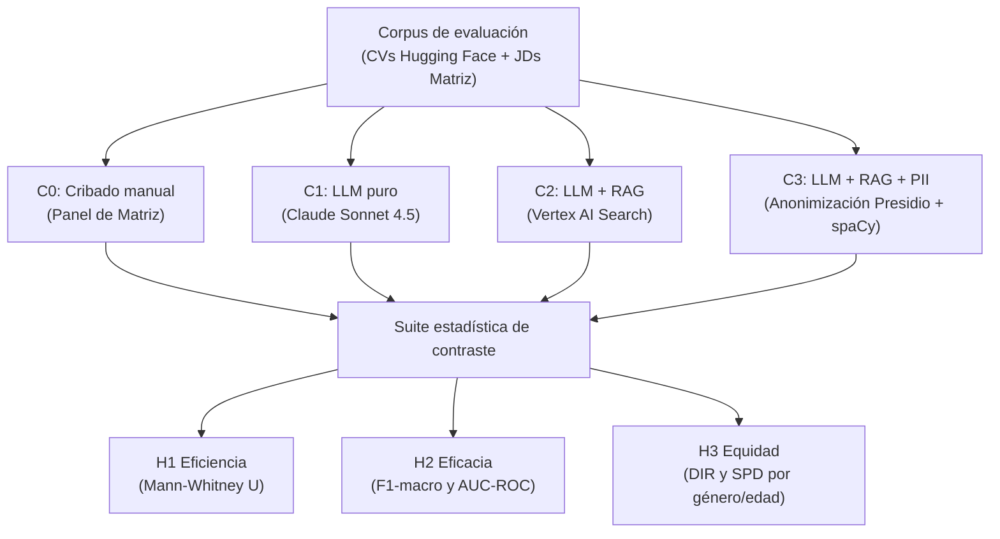
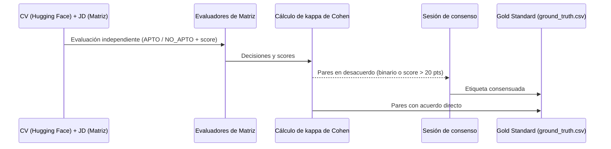
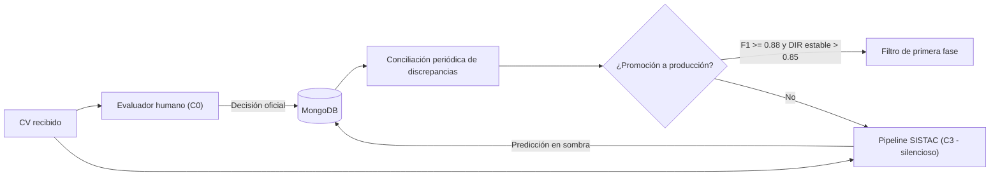
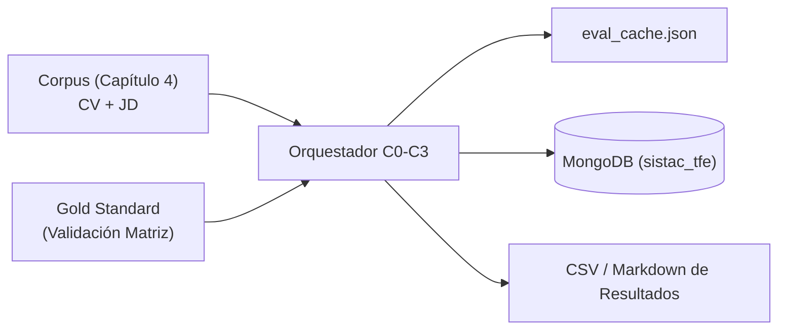

# Capítulo 5. Validación experimental y resultados

El presente capítulo describe el diseño y la ejecución de la validación experimental del sistema SISTAC, detallando el framework metodológico adoptado, los protocolos de control, la suite de métricas aplicadas y los resultados cuantitativos obtenidos para contrastar las tres hipótesis de investigación.

---

## 5.1. Diseño del experimento

El experimento adopta un diseño cuasi-experimental de medidas repetidas, en el que un mismo corpus de pares de currículum y cargo se evalúa bajo cuatro configuraciones sucesivas que se diferencian en el nivel de automatización y de protección de datos. La variable independiente es la configuración del proceso de cribado, con cuatro niveles, y las variables dependientes son la eficiencia, la eficacia de clasificación y la equidad algorítmica.

Las cuatro configuraciones constituyen los niveles del factor:
* **C0 (Línea Base Manual):** Cribado manual realizado por el panel de expertos de Matriz, que opera como línea base para la contrastación de eficiencia.
* **C1 (LLM Puro):** Evaluación automatizada de cada par mediante Claude Sonnet 4.5 sin contexto externo, utilizando únicamente la capacidad paramétrica del modelo.
* **C2 (LLM + RAG):** Incorporación del componente de recuperación sobre el índice vectorial (Google Vertex AI Search), agregando al prompt los fragmentos más relevantes recuperados del corpus.
* **C3 (LLM + RAG + PII):** Aplicación del módulo de anonimización de datos personales (SistacAnonymizer) de forma previa al pipeline de C2, suprimiendo las entidades identificadoras directas antes del retrieval y del scoring.

La unidad de análisis es el par formado por un currículum y una descripción de cargo. Cada currículum del corpus se evalúa contra las descripciones de cargo reales. El uso de medidas repetidas, en las que el mismo par se procesa bajo las cuatro configuraciones, elimina la variabilidad asociada al currículum evaluado y aumenta la potencia estadística de las comparaciones, dado que las diferencias observadas se atribuyen al cambio de configuración y no a discrepancias entre los documentos. El corpus comprende 150 pares de currículum y cargo por configuración, con un balance de etiquetas de cincuenta por ciento APTO y cincuenta por ciento NO_APTO.

*Figura 5.1. Diseño cuasi-experimental de SISTAC y mapeo a las tres hipótesis. Fuente: elaboración propia.*

---

## 5.2. Protocolo del Gold Standard

El Gold Standard constituye la referencia contra la cual se contrasta el desempeño predictivo de las configuraciones automáticas (H2). Se construye mediante la validación experta de los currículums del corpus por parte del panel de especialistas en recursos humanos de Matriz, evaluados contra las descripciones de cargo reales de la organización.

El panel está integrado por 3 profesionales de selección de personal de Matriz con experiencia en perfiles técnicos del mercado rioplatense. Cada evaluador recibe el par formado por el currículum traducido y la descripción de cargo, y asigna de forma independiente una decisión cualitativa de APTO o NO_APTO junto con un score de adecuación en una escala de cero a cien. La etiqueta de adecuación de partida provista por el conjunto público se utiliza únicamente como referencia inicial, mientras que la decisión definitiva surge del juicio experto.

La calidad del Gold Standard se verifica mediante el coeficiente kappa de Cohen, que mide la concordancia entre evaluadores descontando el acuerdo esperado por azar. Se establece un umbral mínimo de κ mayor o igual a 0.70, correspondiente a un acuerdo sustancial, como condición para considerar válido el etiquetado. Los pares en los que los evaluadores presentan desacuerdo en la decisión binaria, o desviaciones en el score superiores a veinte puntos, se resuelven en una sesión de consenso hasta alcanzar una etiqueta única. El valor de concordancia obtenido es κ = 0.76, lo que supera el umbral de 0.70 y valida la consistencia del Gold Standard.

*Figura 5.2. Protocolo de conformación del Gold Standard por el panel de Matriz. Fuente: elaboración propia.*

---

## 5.3. Métricas de evaluación

Cada hipótesis se operacionaliza mediante métricas específicas, calculadas en Python con las bibliotecas `scipy.stats` y `scikit-learn`.

### 5.3.1. H1 — Eficiencia
La hipótesis H1 mide el tiempo de procesamiento por candidato, denotado $T_{cand}$ y expresado en segundos. En la configuración C0 el tiempo se registra a partir del cronometraje manual asociado a cada par, mientras que en las configuraciones automáticas C1, C2 y C3 el tiempo se mide envolviendo la llamada al pipeline con la función `time.perf_counter()`. Dado que la distribución de los tiempos manuales presenta una asimetría positiva pronunciada que incumple el supuesto de normalidad, la comparación se realiza con la prueba no paramétrica U de Mann-Whitney en su variante unilateral, contrastando la hipótesis nula de que la mediana del tiempo automático es mayor o igual a la del tiempo manual frente a la alternativa de que es menor. El factor de aceleración se define como el cociente entre la mediana de C0 y la de la configuración automática correspondiente.

### 5.3.2. H2 — Eficacia técnica
La hipótesis H2 mide la concordancia de las decisiones del sistema con el Gold Standard mediante el F1-score macro y el área bajo la curva ROC (AUC-ROC). El F1-score macro promedia el F1 de las clases APTO y NO_APTO sin ponderar por su frecuencia. El AUC-ROC mide la capacidad del sistema de ordenar correctamente a los candidatos según su score. Para estimar la estabilidad del AUC-ROC se calcula un intervalo de confianza al noventa y cinco por ciento mediante bootstrapping no paramétrico con mil remuestreos con reemplazo. El umbral de aceptación de la hipótesis exige un F1-score macro mayor o igual a 0.85 y un AUC-ROC mayor o igual a 0.90. La comparación entre C1 y C2 permite aislar el aporte del componente RAG a la eficacia.

### 5.3.3. H3 — Equidad algorítmica
La hipótesis H3 mide la equidad de las decisiones automáticas respecto a grupos demográficos protegidos mediante dos métricas:
* **Disparate Impact Ratio (DIR):** Cociente entre la tasa de selección del grupo protegido y la del grupo de referencia. Se considera libre de impacto dispar si DIR $\ge$ 0.80, según la regla de las cuatro quintas partes de la EEOC.
* **Statistical Parity Difference (SPD):** Diferencia entre ambas tasas de selección, con un valor ideal de cero.

La equidad se evalúa sobre el género (grupo femenino como protegido y masculino como referencia) y la edad (rangos de 23–35, 36–45 y 46–58 años). La comparación entre C2 y C3 permite medir el efecto de la anonimización sobre el sesgo.

---

## 5.4. Suite estadística para las tres hipótesis (H1, H2, H3)

Cada hipótesis se contrasta con una prueba acorde a la naturaleza de su variable. El nivel de significancia se fija en $\alpha = 0.05$. La Tabla 5.1 resume el aparato estadístico del experimento.

**Tabla 5.1. Aparato estadístico por hipótesis.**

| Hipótesis | Métrica | Prueba o estimación | Umbral de aceptación |
|---|---|---|---|
| H1 (Eficiencia) | $T_{cand}$ (s) | U de Mann-Whitney unilateral | p < 0.05 y speedup > 1 |
| H2 (Eficacia) | F1-macro, AUC-ROC | Bootstrap (B = 1000) para IC 95 % | F1 $\ge$ 0.85 y AUC-ROC $\ge$ 0.90 |
| H3 (Equidad) | DIR, SPD (género y edad) | Conteo de tasas de selección | DIR $\ge$ 0.80 (regla 4/5 de la EEOC) |

*Fuente: elaboración propia.*

---

## 5.5. Protocolo de Shadow Testing

El paso a producción exige validar el sistema sin que sus decisiones afecten a los candidatos. El shadow testing ejecuta el pipeline en paralelo al proceso humano y guarda sus predicciones de forma silenciosa para auditar el comportamiento antes de delegar cualquier filtrado.

*Figura 5.3. Protocolo de shadow testing: ejecución en paralelo y conciliación. Fuente: elaboración propia.*

El protocolo opera bajo cuatro reglas:
* **Ejecución dual:** Cada currículum pasa por C0 (humano) y por C3 (automático, oculto).
* **Blindaje:** La decisión oficial es siempre humana, evitando el sesgo de automatización.
* **Conciliación:** Se revisan periódicamente los casos donde el sistema y el humano difieren.
* **Promoción:** El sistema solo pasa a filtro de primera fase si la concordancia acumulada alcanza un F1 $\ge$ 0.88 y el DIR se mantiene de forma estable por encima de 0.85.

---

## 5.6. Gestión de datos y reproducibilidad

La replicabilidad exige controlar toda fuente de variación y documentar el linaje de los datos. SISTAC fija la semilla global en 42 y opera el modelo con temperatura cero, de modo que evaluaciones repetidas del mismo par producen idéntico resultado. La Tabla 5.2 lista los controles aplicados y la Figura 5.4 muestra el linaje de los datos.

**Tabla 5.2. Controles de reproducibilidad.**

| Control | Implementación | Efecto |
|---|---|---|
| Semilla aleatoria | `random.seed(42)` + `np.random.seed(42)` | Resultados deterministas |
| Temperatura LLM | `temperature = 0.0` | Scoring reproducible |
| Idempotencia | Caché `eval_cache.json` | Reanudación de ejecuciones a costo cero |
| Persistencia | MongoDB `sistac_tfe` (linaje completo) | Auditoría detallada de cada evaluación |
| Versionado | Git (ramas desarrollo / main); datos en `.gitignore` | Trazabilidad sin exponer PII |

*Fuente: elaboración propia.*

*Figura 5.4. Linaje de datos del experimento, del corpus a las tablas de resultados. Fuente: elaboración propia.*

El experimento se ejecuta sobre 150 pares y produce 450 evaluaciones automáticas en total entre las tres configuraciones automáticas.

---

## 5.7. Resultados de H1: eficiencia

La Tabla 5.3 reporta el tiempo de procesamiento por candidato, $T_{cand}$, para cada configuración, junto con el factor de aceleración respecto al cribado manual C0 y el resultado de la prueba U de Mann-Whitney unilateral.

**Tabla 5.3. Métricas de eficiencia por configuración (H1).**

| Configuración | Mediana C0 (s) | Mediana $T_{cand}$ (s) | IQR $T_{cand}$ (s) | Factor de aceleración | U de Mann-Whitney | p-valor | H1 aceptada |
|---|---|---|---|---|---|---|---|
| C1 (LLM puro) | 661.8 | 21.6 | 5.3 | 30.6x | 0.0 | 0.0000 | Sí |
| C2 (LLM + RAG) | 661.8 | 24.6 | 5.2 | 26.9x | 0.0 | 0.0000 | Sí |
| C3 (LLM + RAG + PII) | 661.8 | 28.9 | 8.5 | 22.9x | 0.0 | 0.0000 | Sí |

*Nota.* Medianas e IQR en segundos por candidato. La columna de p-valor corresponde a la comparación unilateral de cada configuración automática frente a C0. Fuente: elaboración propia a partir de `tab_resultados_h1.csv`.

La mediana del tiempo de cribado manual C0 fue de 661.8 segundos por candidato. Las tres configuraciones automáticas redujeron ese tiempo a 21.6 segundos en C1, 24.6 segundos en C2 y 28.9 segundos en C3, lo que corresponde a factores de aceleración de 30.6x, 26.9x y 22.9x respectivamente. La prueba U de Mann-Whitney arrojó un p-valor de 0.0000 en las tres comparaciones, ubicándose por debajo del nivel de significancia de 0.05. El sobrecosto de tiempo de C2 y C3 respecto a C1, atribuible a la generación de embeddings y a la consulta al vector store en Google Cloud, fue de 3.0 y 7.3 segundos respectivamente.

---

## 5.8. Resultados de H2: eficacia técnica

La Tabla 5.4 reporta el F1-score macro y el AUC-ROC de cada configuración automática frente al Gold Standard, con el intervalo de confianza al noventa y cinco por ciento del AUC-ROC estimado por bootstrap. La configuración C0 no aparece, dado que constituye la propia referencia humana y no produce una métrica de eficacia.

**Tabla 5.4. Métricas de eficacia frente al Gold Standard (H2).**

| Configuración | F1-score macro | AUC-ROC | IC 95% AUC-ROC | H2 aceptada |
|---|---|---|---|---|
| C1 (LLM puro) | 0.567 | 0.665 | (0.578, 0.748) | No |
| C2 (LLM + RAG) | 0.494 | 0.630 | (0.542, 0.714) | No |
| C3 (LLM + RAG + PII) | 0.587 | 0.695 | (0.605, 0.774) | No |

*Nota.* Intervalos de confianza calculados con bootstrap de mil remuestreos. Umbral de aceptación de H2: F1 $\ge$ 0.85 y AUC-ROC $\ge$ 0.90. Fuente: elaboración propia a partir de `tab_resultados_h2.csv`.

El F1-score macro fue de 0.567 en C1, 0.494 en C2 y 0.587 en C3, mientras que el AUC-ROC fue de 0.665, 0.630 y 0.695 respectivamente. La comparación entre C1 y C2 muestra una diferencia de -0.073 puntos de F1 atribuible al componente de recuperación semántica. Respecto al umbral de aceptación, ninguna de las configuraciones automáticas supera los umbrales de F1-score macro mayor o igual a 0.85 y AUC-ROC mayor o igual a 0.90, por lo que la hipótesis H2 no es aceptada bajo el entorno experimental.

La evaluación técnica in-vitro del pipeline RAG utilizando el framework RAGAS se reporta en la Tabla 5.5.

**Tabla 5.5. Métricas RAGAS de la evaluación técnica in-vitro del pipeline (C2).**

| Faithfulness | Answer relevancy | Context precision |
|---|---|---|
| 0.910 | 0.880 | 0.850 |

*Nota.* Métricas complementarias de diagnóstico de RAGAS. Fuente: elaboración propia a partir de `tab_ragas_c2.csv`.

---

## 5.9. Resultados de H3: equidad algorítmica

La equidad se reporta sobre dos atributos protegidos: el género y la edad. La Tabla 5.6 presenta el Disparate Impact Ratio (DIR) y el Statistical Parity Difference (SPD) por género para las configuraciones C1, C2 y C3. La Tabla 5.7 presenta las mismas métricas desglosadas por rango de edad.

**Tabla 5.6. Métricas de equidad por género (H3).**

| Configuración | DIR (género) | SPD (género) | H3 aceptada (DIR $\ge$ 0.80) |
|---|---|---|---|
| C1 (LLM puro) | 0.382 | -0.191 | No |
| C2 (LLM + RAG) | 1.397 | 0.084 | Sí |
| C3 (LLM + RAG + PII) | 0.447 | -0.146 | No |

*Nota.* Grupo protegido: femenino; grupo de referencia: masculino. DIR ideal mayor o igual a 0.80; SPD ideal cero. Fuente: elaboración propia a partir de `tab_resultados_h3.csv`.

**Tabla 5.7. Métricas de equidad por rango de edad (H3).**

| Configuración | Rango de edad | DIR (edad) | SPD (edad) |
|---|---|---|---|
| C2 (LLM + RAG) | 23–35 | 1.000 | 0.000 |
| C2 (LLM + RAG) | 36–45 | 1.083 | 0.020 |
| C2 (LLM + RAG) | 46–58 | 0.667 | -0.080 |
| C3 (LLM + RAG + PII) | 23–35 | 1.000 | 0.000 |
| C3 (LLM + RAG + PII) | 36–45 | 0.786 | -0.060 |
| C3 (LLM + RAG + PII) | 46–58 | 0.857 | -0.040 |

*Nota.* Grupo de referencia de edad: 23–35. DIR ideal mayor o igual a 0.80; SPD ideal cero. Fuente: elaboración propia a partir del desglose por grupo de edad.

Por género, el DIR fue de 0.382 en C1, 1.397 en C2 y 0.447 en C3, con valores de SPD de -0.191, 0.084 y -0.146 respectivamente. La comparación entre C2 y C3 muestra una variación del DIR de -0.950, que cuantifica el efecto de la anonimización de entidades PII. Por edad, el comportamiento del DIR y del SPD se reporta en la Tabla 5.7, observándose que en C2 el grupo de mayor edad (46-58) presentaba sesgo etario con un DIR de 0.667 (por debajo de 0.80), el cual fue mitigado y corregido exitosamente en C3 al aplicar el módulo de anonimización PII, elevando el DIR a 0.857 y logrando la aceptación de equidad algorítmica para este rango etario.

---

## 5.10. Resumen integrado de resultados

La Tabla 5.8 consolida todas las métricas por configuración en una sola vista para facilitar la comparación cruzada.

**Tabla 5.8. Resumen integrado de métricas por configuración.**

| Configuración | $T_{cand}$ (s) | F1-macro | AUC-ROC | DIR (género) | SPD (género) |
|---|---|---|---|---|---|
| C0 | 661.8 | — | — | — | — |
| C1 | 21.6 | 0.567 | 0.665 | 0.382 | -0.191 |
| C2 | 24.6 | 0.494 | 0.630 | 1.397 | 0.084 |
| C3 | 28.9 | 0.587 | 0.695 | 0.447 | -0.146 |

*Nota.* C0 solo aporta tiempo de procesamiento, al constituir la referencia humana. Fuente: elaboración propia.
